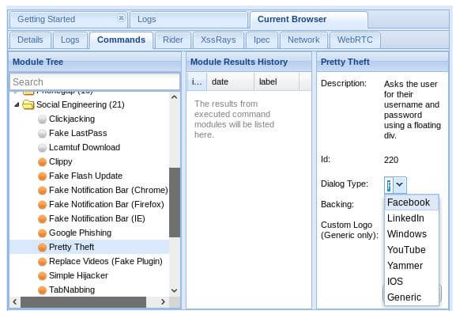
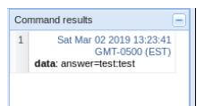

# BeEF

BeEF (The Browser Exploitation Framework), joka on <b>penetraatiotestaustyökalu</b>, joka keskityy verkkoselaimeen.

Penetraatio tarkoittaa läpäisyn tai tunkeutumista johonkin, että tarkoittaa myös tietomurtojen suojattuun tietojärjestelmän ulkoverkon kautta.

BeEF antaa ammattimaiselle leviämistestausta arvioidakseen kohdeympäristön todellisen suojausasennon käyttämällä asiakaspuolen hyökkäysvektoria. Toisin/muualle eri tavalla kuin tietoturvakehystä, BeEF tutkii kovetetun verkon kehän ja asiakasjärjestelmän ohi ja tutkii hyödynnettävyyden kuin yhden oven, verkkoselaimen puuteita. BeEF kiinittää yhden tai useamman verkkoselaimen ja käyttää niitä rantapäänä (beachheads) ohjattuihin komento moduulia käynnistämisessä ja lisähyökkäyksien järjestelmää vastaan selainkontekstissa.

  
The title of the image group

    
    
    

    

##