# Burp Suite proxy tool

Just click on navigation bar "Proxy" tool, whit this tool can interecpt any request send from the browser before it is passed on to the server. It can change almost anything abou the request such as parameter names, form values or adding new headers. With this let penetration tester how an application handles unexpected arbitrary input. E.g. an input field might have a size limit of 20 characters, but with Burp Suite to modify a request to submit 30 characters.

To order to set up a proxy, and disable the "interecpt tool", check under the Interecpt tab. When "Intercept" is enabled, so it manually click on "Forward" to send each request onward to its destination. When click "Drop" to not send the request. There are times when want to intercept traffic and modify it, but are just for browsing a site, have to click "Forward" on each request to becomes veri tedious.

Basically button "Intercept" is like on/off toggle to displays the current situation current state of the tool and it will can be used to enable or disabled it as required. So, for set this to "Intercept" is off to allow the target browser traffic to flow normally.

* [First check](#First-check)
* [Another check](#Another-check)
* [Third example](#Third-example)

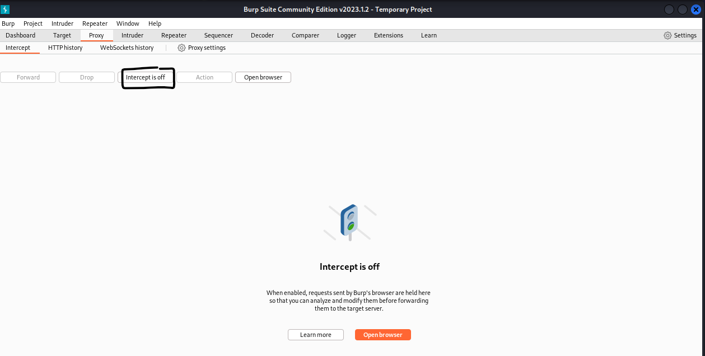

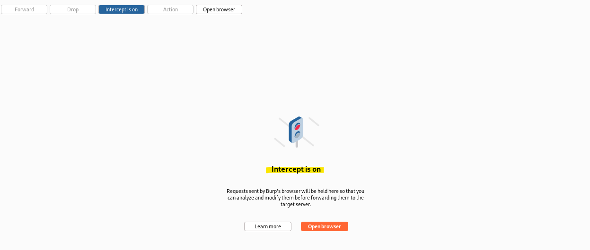

## First check

Small practices so review the proxy listener settings. The "proxy settings" sub-tab show what ports are listening for proxy requests.

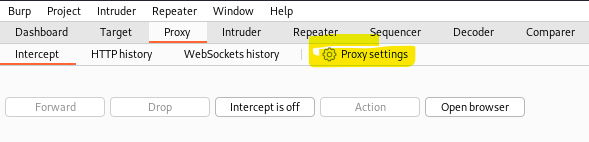

This is just default view, is enables a proxy listener on "localhost:8080". This is just the host and port the browser must connect to in order to proxy traffic through Burp Suite. Let the default setting alone (leave it).

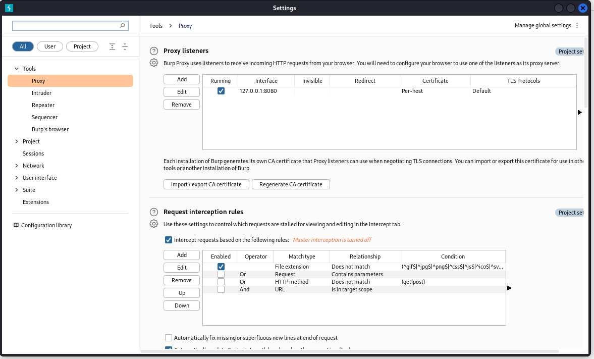

## Another check
<!-- Offensive-Security-OSCP-by-Offensive-Security_2020.pdf PAGE; 255 - --> 

Check the revivew is at "proxy" -> "Http history" at as default it's empty and blank until traffic has been sent through Burp Suite.

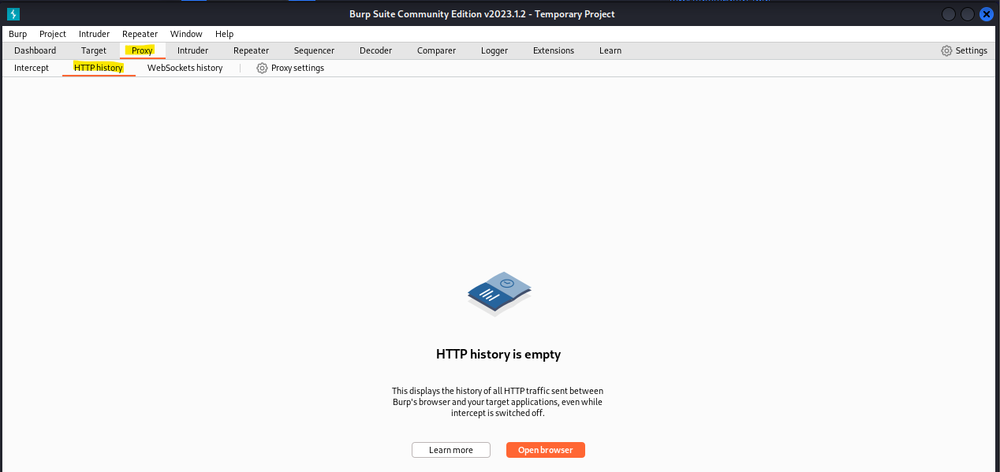

At book & its author Foxy Proxy Basic is a simple using "on/off proxy switcher" add on Kali Linux default browser FireFox. This small check is just how to "Add-ons" on browser, just go to enable or disbale Fire Fox proxy settings. This install is from within FireFox by clicking the Open menu button and select "add ons and themes" from the menu.

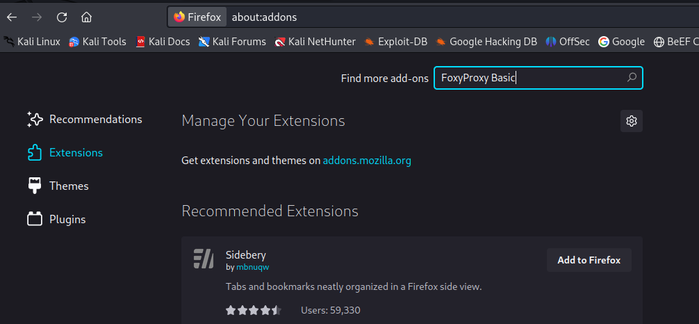

When "add ons and theme" page is open, search for "foxyproxy basic" by enetering it in the search box (same as super search find some more items)
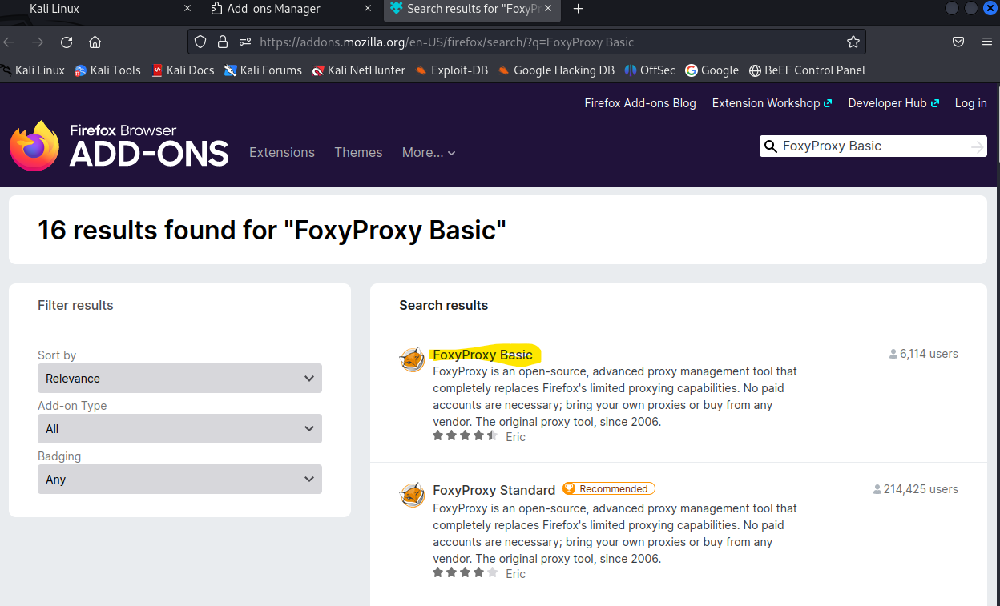

There exist two version of Foxy Proxy as "Basic" and "Standard". So use the "basic" version because it is easier to confingure and do not need any of the extra functionality of the standard version.

Click the Basic versio to view more details about the extension and add to browser FireFox to install the add-on

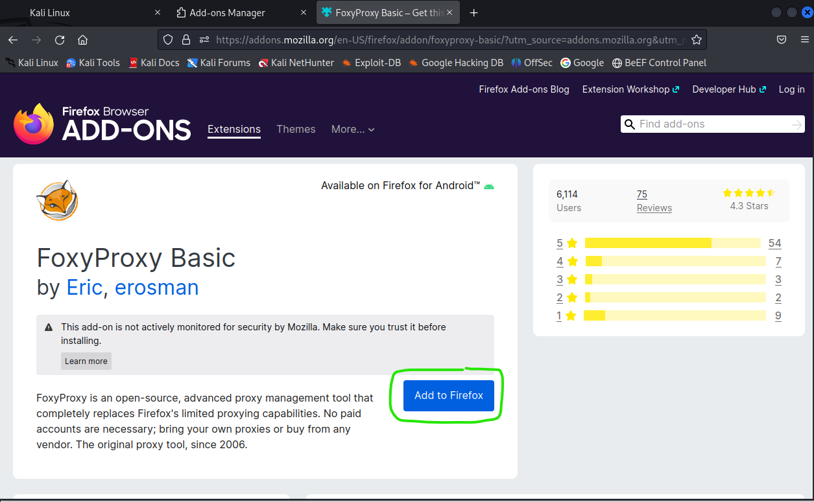

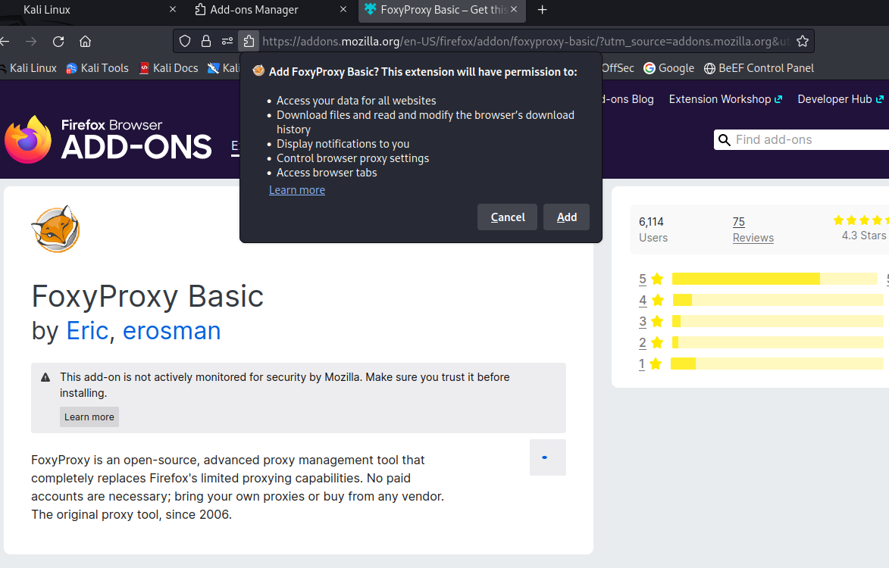

after the installation it will added to right corner for small icon. Click the "options" it will give a new page of this Foxy tool view.

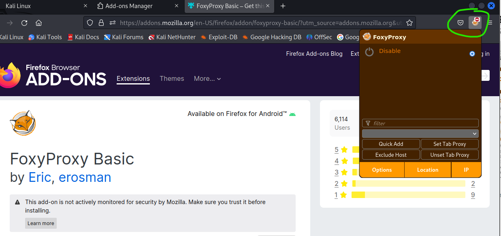

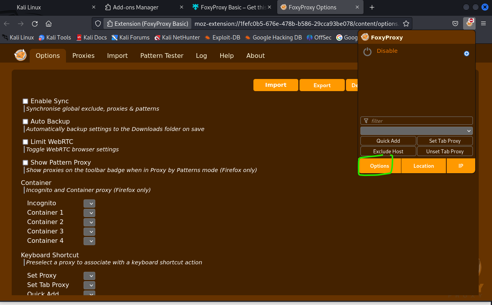

At "Proxies" navigator bar, can set first Proxyu Type "http" and enter title (give a name), and using IP-address (127.0.0.1). This will add BUrp Suite proxy listener port number which left as the default of 8080 port, and save it.

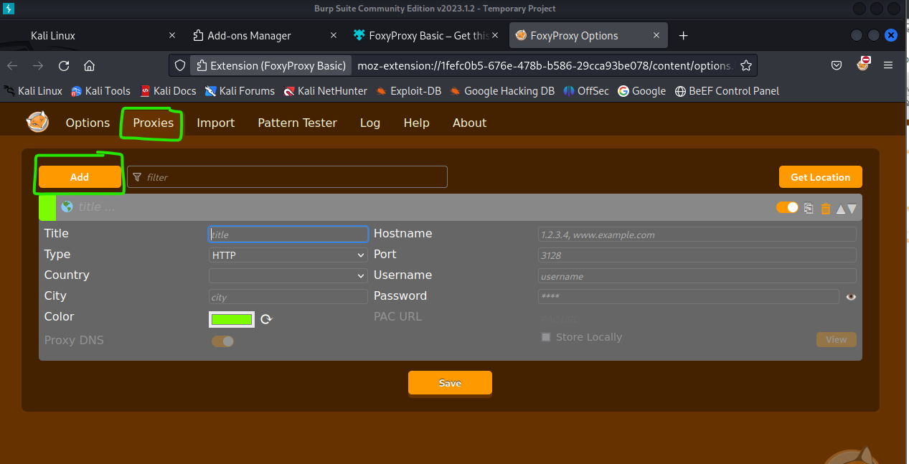

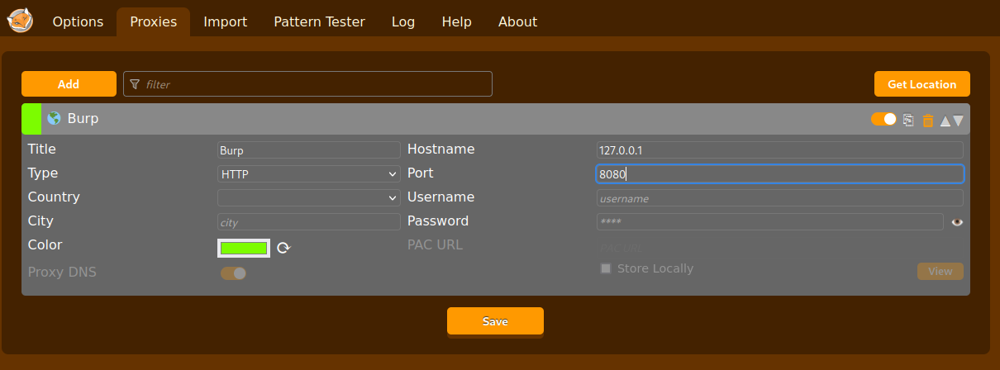

After save it, it will added to add-on under the list. 

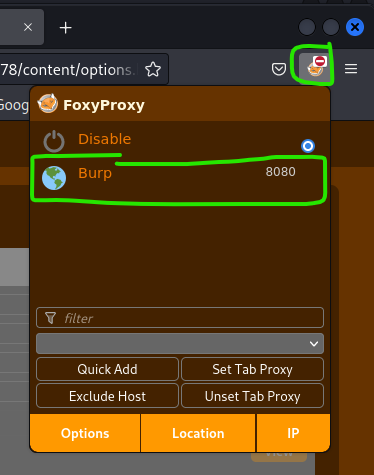

## Third example

Actually this Burp Suite this third example is like firewall/linux/web application settings, it will block the user go to host site like surfing, video games, gambling or ect websites. Like example organization there websites from list are not allow it (access denied) like block these sites network traffic it.

Host can be an IP-address or real host like a hostname of the website.

Only administrator or other type network administrator or other administrator type can make it allow or block, or even edit the network traffic like as whitelist.

For example block this site "www.megacorpone.com" as type "HTTP" and save it, and it will added to browser "Add-on" under the list, and actived it, as choose it.

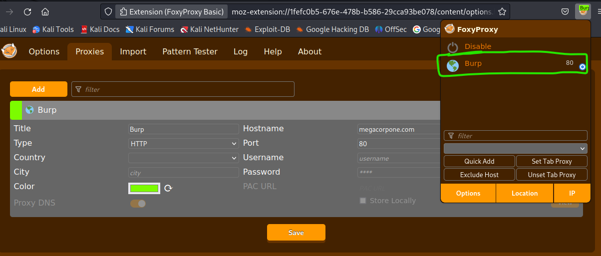

At short moments times it will block this traffic site, so user can not go to this website. It works also either reality, if using chrome/edge browser it does block it at same time until "Disable" it.

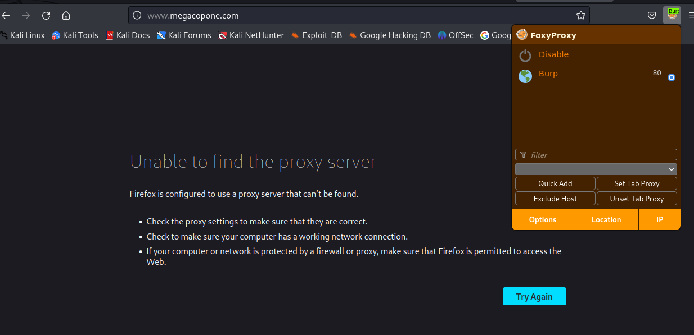

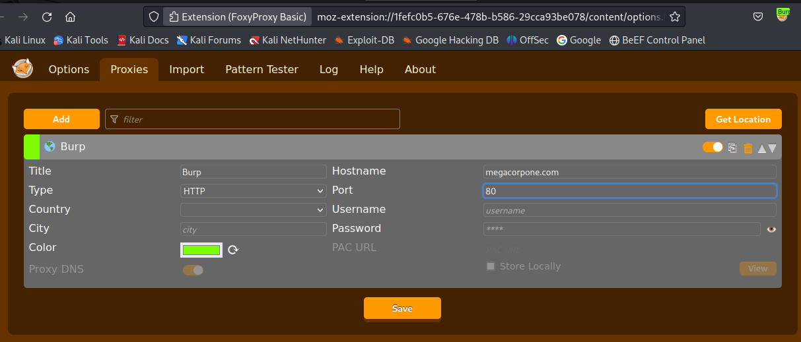

If refresh the page does not work try to open another "tab" and input the host site name and try again. It might be take for moment because it's trying to find the DNS/IP-address and ect from the network traffic.

Although can even at the same times try to ping the host, what is the status where it's going through.

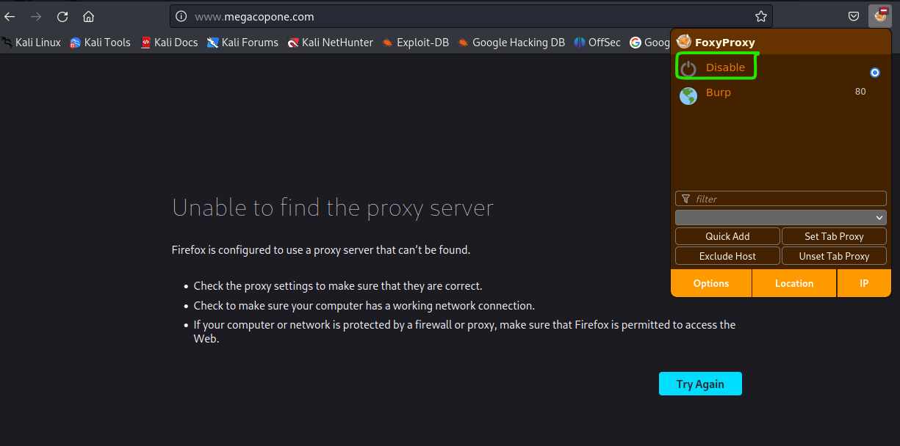

