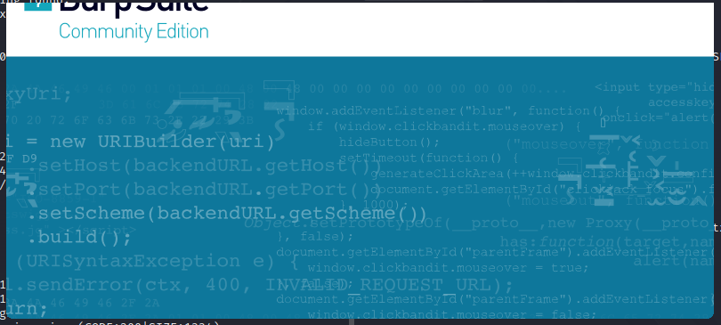
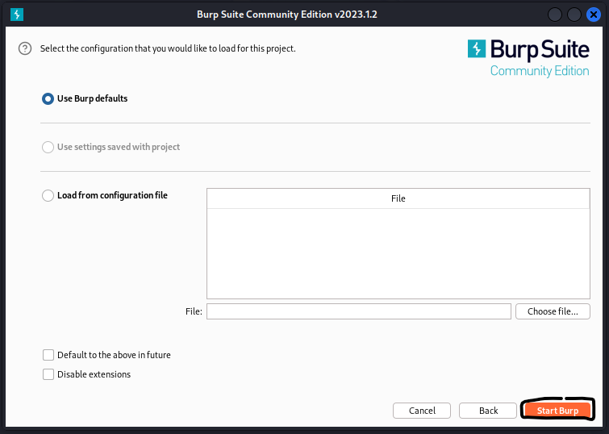
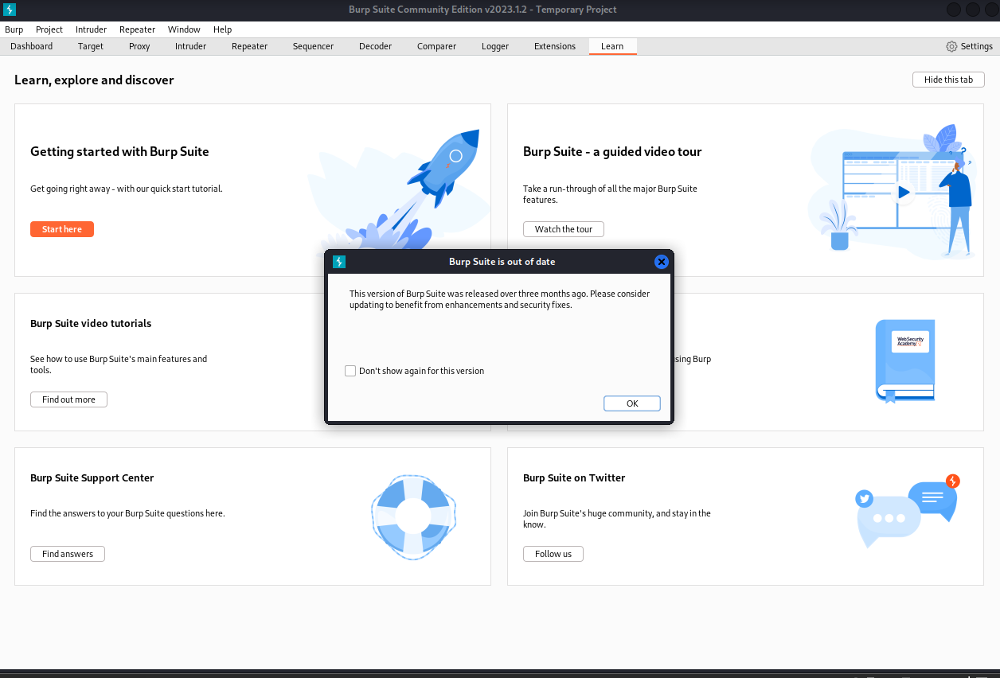
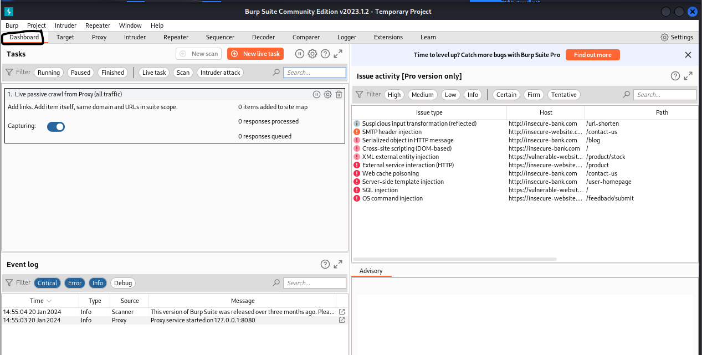

# Burp Suite small guide
It may looks different as book, but it will upgrade to different version and UI may look like differents.. Anyway first view.

This is found on Kali Linux UI by under  Kali under Applications > 03 Web Application Analysis > burpsuite
OR
another options on command `$burpsuite`

This is Burp default view, just click "Next"

Default view, and again "Start Burp"

At short moment and the UI will load, and just go to "Dashboard" view

