# Badstore harjoitus

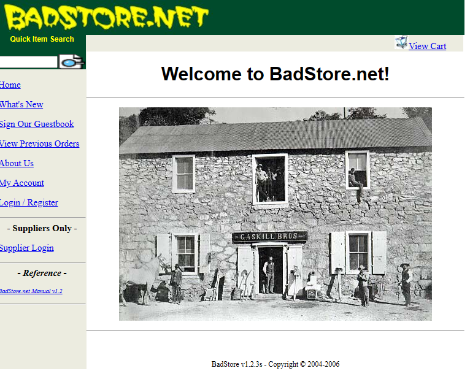

- [Badstore harjoitus](#badstore-harjoitus)
    * [vm (virtual machines)](#vm-virtual-machines)
    * [steppi vaiheet](#steppi-vaiheet)
    * [mysql tietokanta](#mysql-tietokanta)

- [tarkempaa ohjetta](#tarkempaa-ohjetta)
    * [cheat sheets](#cheat-sheets)

## vm (virtual machines)

Harjoituksen kannalta kantsii mietii mihin tätä voisi suorittaa tai harjoittella oikeasti, että nykyään on paljon virtualikoneita joko suorittaa fyysisen oma työkoneen vmware, virtualbox tai hyper-v pohjaan tai <i> maksullise/maksuttoman </i> aws, azure tai google cloud virtuaalikone ympäristöön. 

Methodia on paljon, mutta yksi suosittuimista harjoituksista on esim. lataa ".iso" tiedoston, että upottaa sen vmware tai virtualbox virtuaalikoneen pohjaan.

## steppi vaiheet

Harjoituksessa löytyy muutamia haavoituvuuksia, tekijöitä, salapoliisityötä tai jopa tutkimista, mutta ei tarvi mennä näiden kuvien mukaan. Näiden varsinaisia tuloksia löytyy useita sivustoista ja tänne kirjoitettu ainakin osa toiminnasta.

<b>Feedback</b>
<br><br>

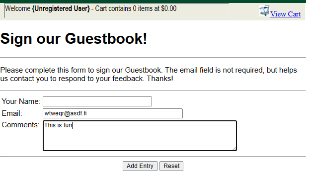

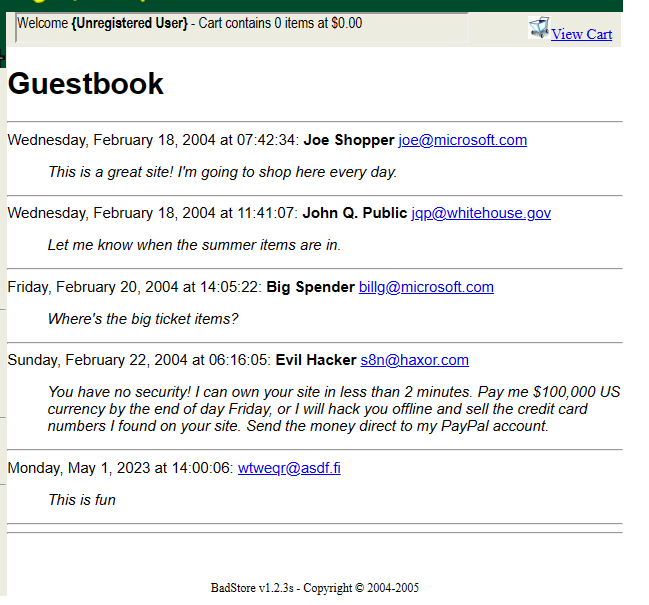

<hr>

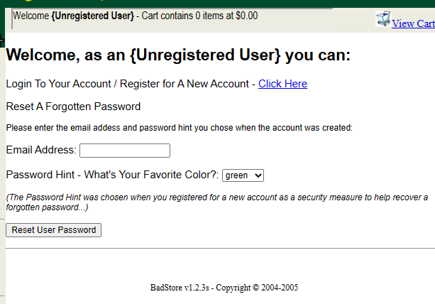

<hr>

<b>Luo rekisteri tunnus sisään</b>

Ennen kun luo tunnuksensa kantsii avata F12 tai oikea hiirestä (inspect), kategoriasta (network) ja riittää (ctrl ja R), ikäänkuin päivittää sivuston. Niin valikkosta "action=register" näkyy, minkä käyttäjätunnuksen on luotu äskeittäin. Myös jos samanaikaisesti on aktivoinnut <b>wireshark</b> työkalun sivussa niin tämäkin toistuu siellä skannauksessa, mutta ei haittaa jos ei ole laitanut sitä päälle. Voi yrittää rekisteröidä uutta tunnusta niin sielä ponnahtaa pien ilmoitus ja kantsii vielä filtteröidä wireshark näkymää.

Role = U (user) ja A = admin
<br>
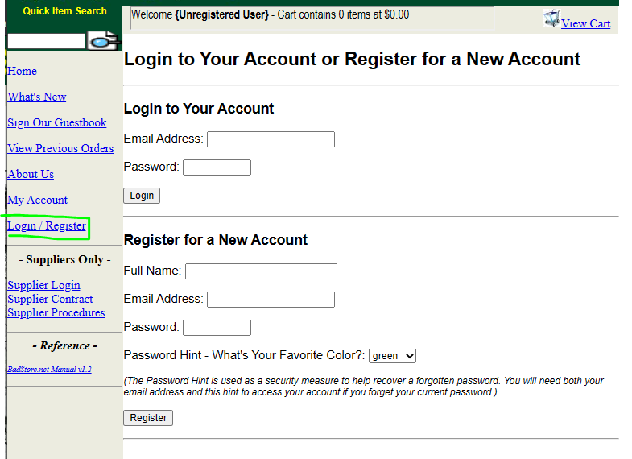

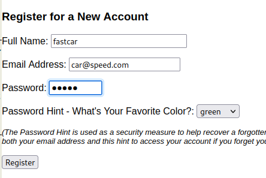

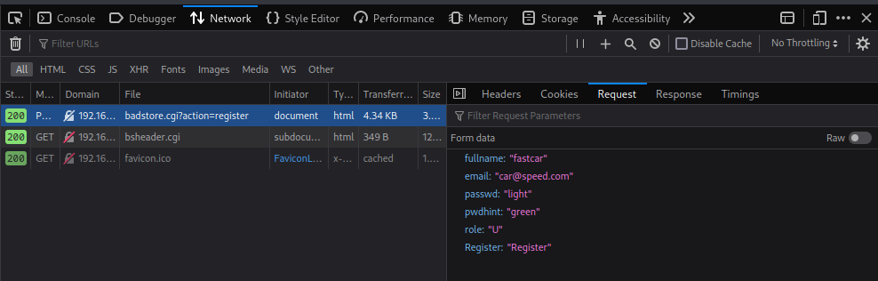

Tämän kuvan "after" ylemmässä on luotu uusi käyttis, että annettaan sille esim. admin oikeudet, mutta oikeudesta ei kauheasti anna mitään tasoa, että pitää mennä oikean admin tunnuksilla sisään. Tässä on vain näytetty kuinka sitä tapahtuu, kun tässä haavoittuvuudessa on oikein tapahtuu tai kuinka hakkeroituu sisään. 
<br><br>

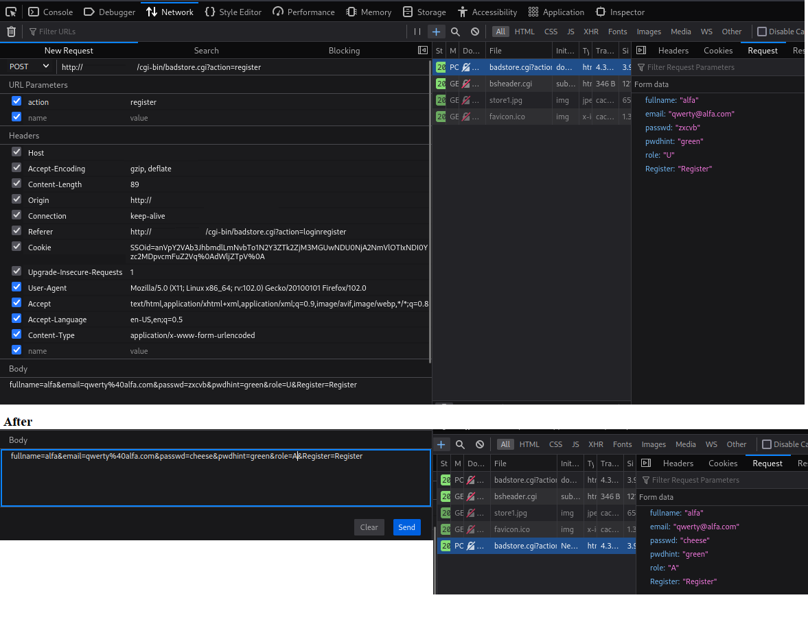

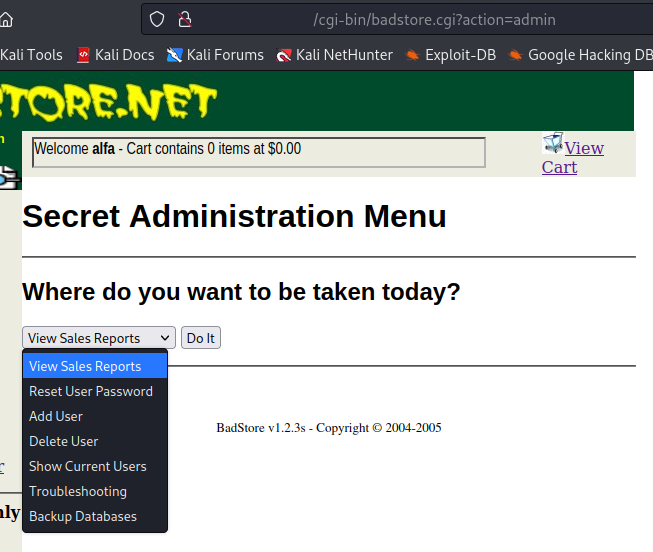

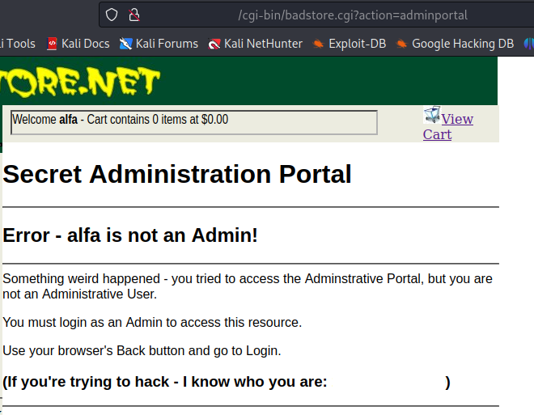

<hr>

<b>Random tilaus</b>
<br><br>
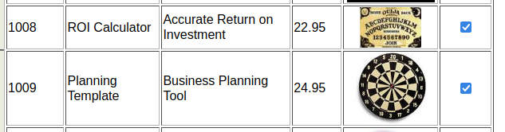

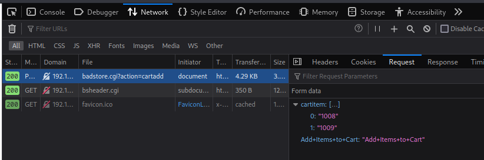

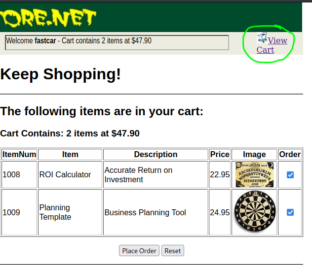

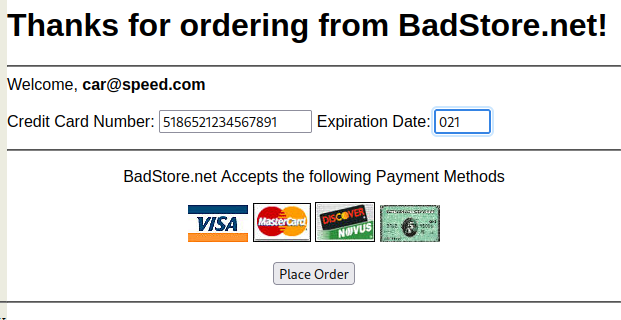


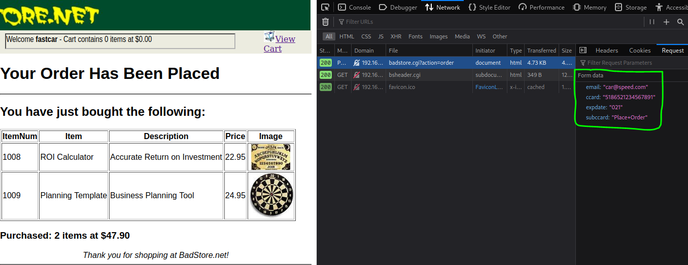

<hr>

## mysql tietokanta

```
└─$ mysql -h <host> -u root
Welcome to the MariaDB monitor.  Commands end with ; or \g.
Your MySQL connection id is 9
Server version: 4.1.7-standard

Copyright (c) 2000, 2018, Oracle, MariaDB Corporation Ab and others.

Type 'help;' or '\h' for help. Type '\c' to clear the current input statement.

MySQL [(none)]> show databases;
+------------+
| Database   |
+------------+
| badstoredb |
+------------+
1 row in set (0.001 sec)

MySQL [(none)]> use badstoredb;
Reading table information for completion of table and column names
You can turn off this feature to get a quicker startup with -A

Database changed
MySQL [badstoredb]> show tables;
+----------------------+
| Tables_in_badstoredb |
+----------------------+
| acctdb               |
| itemdb               |
| orderdb              |
| userdb               |
+----------------------+
4 rows in set (0.001 sec)

MySQL [badstoredb]> select * from acctdb;
+----------+----------+-----------+------------+-------------------+------+
| invnum   | amount   | status    | paidon     | bankinfo          | rma  |
+----------+----------+-----------+------------+-------------------+------+
| MS-45921 |  4976.48 | Paid      | 2023-05-01 | 33011:38349873766 | 0    |
| MS-45876 |   983.93 | Submitted | 2023-05-01 | 33011:38349873766 | 1    |
| MS-45873 | 34897.21 | Received  | 2023-04-30 | 78011:38334587297 | 0    |
+----------+----------+-----------+------------+-------------------+------+
3 rows in set (0.001 sec)

MySQL [badstoredb]> select * from itemdb;
+---------+--------------------+------------------------------------------+------+--------+---------+-------+
| itemnum | sdesc              | ldesc                                    | qty  | cost   | price   | isnew |
+---------+--------------------+------------------------------------------+------+--------+---------+-------+
|    1000 | Snake Oil          | Useless but expensive                    |    5 |   4.35 |   11.50 | Y     |
|    1001 | Crystal Ball       | The finest Austrian crystal for complete |    2 |  13.95 |   49.95 | N     |
|    1002 | Magic Hat          | The classic magicians hat                |    7 |  18.45 |   60.00 | N     |
|    1003 | Magic Rabbit       | Cute white bunny                         |   27 |   3.50 |   12.50 | Y     |
|    1004 | Security Appliance | Everybody needs one                      |    3 | 400.00 | 3999.00 | N     |
|    1005 | Perfect Code       | The rarest magic of all                  |    1 |   5.00 | 5000.00 | Y     |
|    1006 | Security Blanket   | Keeps you warm and toasty                |    4 |   9.50 |   16.00 | N     |
|    1007 | Bag 'o Fud         | For those who believe anything           |    9 |   0.50 |  200.00 | N     |
|    1008 | ROI Calculator     | Accurate Return on Investment            |   99 |   2.30 |   22.95 | Y     |
|    1009 | Planning Template  | Business Planning Tool                   |    2 |   6.70 |   24.95 | Y     |
|    1010 | Security 911       | Technical Support Agreement              |    1 |  99.00 | 9999.00 | N     |
|    1011 | Money              | There's never enough                     |    1 |   3.00 |   90.00 | Y     |
|    1012 | Endless Cup        | Perfect for late nights                  |   74 |   4.56 |   23.98 | Y     |
|    1013 | Invisibility Cloak | For when you just want to hide           |    1 |   0.00 | 8995.00 | N     |
|    1014 | Disappearing Ink   | Makes perfect signatures                 |   43 |   8.96 |   30.95 | Y     |
|    9999 | Test               | Test Item                                |    0 |   0.00 |    0.00 | N     |
+---------+--------------------+------------------------------------------+------+--------+---------+-------+
16 rows in set (0.001 sec)

MySQL [badstoredb]> select * from orderdb;
+------------+------------+-----------+-----------+------------+----------------+------------------+-----------------+----------+------------------+---------+
| sessid     | orderdate  | ordertime | ordercost | orderitems | itemlist       | accountid        | ipaddr          | cartpaid | ccard            | expdate |
+------------+------------+-----------+-----------+------------+----------------+------------------+-----------------+----------+------------------+---------+
| 1078228766 | 2023-05-01 | 13:41:00  | $46.95    |          3 | 1000,1003,1008 | joe@supplier.com | 10.10.10.50     | Y        | 4111111111111111 | 0705    |
| 1078228767 | 2023-05-01 | 13:41:00  | $46.95    |          3 | 1000,1003,1008 | joe@supplier.com | 10.10.10.150    | Y        | 5500000000000004 | 0905    |
| 1078229834 | 2023-04-30 | 13:40:59  | $22.95    |          1 | 1008           | joe@supplier.com | 10.10.10.50     | Y        | 340000000000009  | 1008    |
| 1078232948 | 2023-04-30 | 11:35:58  | $144.93   |          3 | 1011,1012,1014 | mary@spender.com | 192.168.10.70   | Y        | 30000000000004   | 0506    |
| 1078232048 | 2023-04-30 | 13:41:00  | $137.90   |          3 | 1008,1009,1011 | sue@spender.com  | 10.10.10.350    | Y        | 601100000004     | 1006    |
| 1078228766 | 2023-05-01 | 13:41:00  | $46.95    |          3 | 1000,1003,1008 | joe@supplier.com | 10.10.10.50     | Y        | 4111111111111111 | 0705    |
| 1078228767 | 2023-04-29 | 13:41:00  | $46.95    |          3 | 1000,1003,1008 | joe@supplier.com | 10.10.10.150    | Y        | 5500000000000004 | 0905    |
| 1078229834 | 2023-04-29 | 05:31:56  | $22.95    |          1 | 1008           | joe@supplier.com | 10.10.10.50     | Y        | 340000000000009  | 1008    |
| 1078232048 | 2023-04-29 | 11:06:52  | $137.90   |          3 | 1008,1009,1011 | mary@spender.com | 192.168.10.70   | Y        | 30000000000004   | 0506    |
| 1078232048 | 2023-04-29 | 13:41:00  | $137.90   |          3 | 1008,1009,1011 | sue@spender.com  | 10.10.10.350    | Y        | 6011000000000004 | 1006    |
| 1078228766 | 2023-04-28 | 13:41:00  | $46.95    |          3 | 1000,1003,1008 | joe@supplier.com | 10.10.10.50     | Y        | 4111111111111111 | 0705    |
| 1078228767 | 2023-04-28 | 13:41:00  | $46.95    |          3 | 1000,1003,1008 | joe@supplier.com | 10.10.10.150    | Y        | 5500000000000004 | 0905    |
| 1078229834 | 2023-04-28 | 13:41:00  | $22.95    |          1 | 1008           | joe@supplier.com | 10.10.10.50     | Y        | 340000000000009  | 1008    |
| 1078232048 | 2023-04-28 | 13:41:00  | $137.90   |          3 | 1008,1009,1011 | mary@spender.com | 192.168.10.70   | Y        | 30000000000004   | 0506    |
| 1078232048 | 2023-04-27 | 10:34:58  | $137.90   |          3 | 1008,1009,1011 | sue@spender.com  | 10.10.10.350    | Y        | 6011000000000004 | 1006    |
| 1078228766 | 2023-04-25 | 06:38:52  | $46.95    |          3 | 1000,1003,1008 | joe@supplier.com | 10.10.10.50     | Y        | 4111111111111111 | 0705    |
| 1078228767 | 2023-04-24 | 13:41:00  | $46.95    |          3 | 1000,1003,1008 | joe@supplier.com | 10.10.10.150    | Y        | 5500000000000004 | 0905    |
| 1078229834 | 2023-04-18 | 11:36:51  | $22.95    |          1 | 1008           | joe@supplier.com | 10.10.10.50     | Y        | 340000000000009  | 1008    |
| 1078232048 | 2023-04-12 | 13:41:00  | $137.90   |          3 | 1008,1009,1011 | mary@spender.com | 192.168.10.70   | Y        | 30000000000004   | 0506    |
| 1078232388 | 2023-04-12 | 13:41:00  | $1137.90  |          3 | 1008,1009,1011 | sue@spender.com  | 10.10.10.350    | Y        | 6011000000000004 | 1006    |
| 1078233380 | 2023-03-27 | 13:41:00  | $360.00   |          1 | 1002           | fred@newuser.com | 172.22.15.47    | Y        | 201400000000009  | 0705    |
| 1682950404 | 2023-05-01 | 14:15:25  | $47.90    |          2 | 1008,1009      | car@speed.com    | 192.163.23.120 | Y        | 5186521234567891 | 021     |
+------------+------------+-----------+-----------+------------+----------------+------------------+-----------------+----------+------------------+---------+
22 rows in set (0.001 sec)

MySQL [badstoredb]> 
MySQL [badstoredb]> select * from userdb;
+----------------------+----------------------------------+---------+-----------------------------+------+
| email                | passwd                           | pwdhint | fullname                    | role |
+----------------------+----------------------------------+---------+-----------------------------+------+
| AAA_Test_User        | 098F6BCD4621D373CADE4E832627B4F6 | black   | Test User                   | U    |
| admin                | 5EBE2294ECD0E0F08EAB7690D2A6EE69 | black   | Master System Administrator | A    |
| joe@supplier.com     | 62072d95acb588c7ee9d6fa0c6c85155 | green   | Joe Supplier                | S    |
| big@spender.com      | 9726255eec083aa56dc0449a21b33190 | blue    | Big Spender                 | U    |
| ray@supplier.com     | 99b0e8da24e29e4ccb5d7d76e677c2ac | red     | Ray Supplier                | S    |
| robert@spender.net   | e40b34e3380d6d2b238762f0330fbd84 | orange  | Robert Spender              | U    |
| bill@gander.org      | 5f4dcc3b5aa765d61d8327deb882cf99 | purple  | Bill Gander                 | U    |
| steve@badstore.net   | 8cb554127837a4002338c10a299289fb | red     | Steve Owner                 | U    |
| fred@whole.biz       | 356c9ee60e9da05301adc3bd96f6b383 | yellow  | Fred Wholesaler             | U    |
| debbie@supplier.com  | 2fbd38e6c6c4a64ef43fac3f0be7860e | green   | Debby Supplier              | S    |
| mary@spender.com     | 7f43c1e438dc11a93d19616549d4b701 | blue    | Mary Spender                | U    |
| sue@spender.com      | ea0520bf4d3bd7b9d6ac40c3d63dd500 | orange  | Sue Spender                 | U    |
| curt@customer.com    | 0DF3DBF0EF9B6F1D49E88194D26AE243 | green   | Curt Wilson                 | U    |
| paul@supplier.com    | EB7D34C06CD6B561557D7EF389CDDA3C | red     | Paul Rice                   | S    |
| kevin@spender.com    | NULL                             | NULL    | Kevin Richards              | U    |
| ryan@badstore.net    | 40C0BBDC4AEEAA39166825F8B477EDB4 | purple  | Ryan Shorter                | A    |
| stefan@supplier.com  | 8E0FAA8363D8EE4D377574AEE8DD992E | yellow  | Stefan Drege                | S    |
| landon@whole.biz     | 29A4F8BFA56D3F970952AFC893355ABC | purple  | Landon Scott                | U    |
| sam@customer.net     | 5EBE2294ECD0E0F08EAB7690D2A6EE69 | red     | Sam Rahman                  | U    |
| david@customer.org   | 356779A9A1696714480F57FA3FB66D4C | blue    | David Myers                 | U    |
| john@customer.org    | EEE86E9B0FE29B2D63C714B51CE54980 | green   | John Stiber                 | U    |
| heinrich@supplier.de | 5f4dcc3b5aa765d61d8327deb882cf99 | red     | Heinrich Hüber          | S    |
| tommy@customer.net   | 7f43c1e438dc11a93d19616549d4b701 | orange  | Tom O'Kelley                | U    |
| cup@cake.fcom        | 8b823f49ba31caa5cd88e520c2f82bdc | red     | sweetcake                   | U    |
| cup@cake.fcom        | 8b823f49ba31caa5cd88e520c2f82bdc | red     | sweetcake                   | U    |
| car@speed.com        | 2ac43aa43bf473f9a9c09b4b608619d3 | green   | fastcar                     | U    |
| juice@orange.com     | a7887cc809cf0d4df17fc5dafd03e4e7 | green   | orangejuice                 | A    |
| qwerty@alfa.com      | eb89f40da6a539dd1b1776e522459763 | green   | alfa                        | U    |
| qwerty@alfa.com      | fea0f1f6fede90bd0a925b4194deac11 | green   | alfa                        | A    |
+----------------------+----------------------------------+---------+-----------------------------+------+

26 rows in set (0.001 sec)

```

# tarkempaa ohjetta
https://medium.com/syscall59/badstore-1-2-3-walkthrough-vulnhub-7816f3001333


## cheat sheets

https://maimonideanangst.wordpress.com/2012/03/30/hacking-cheat-sheet/