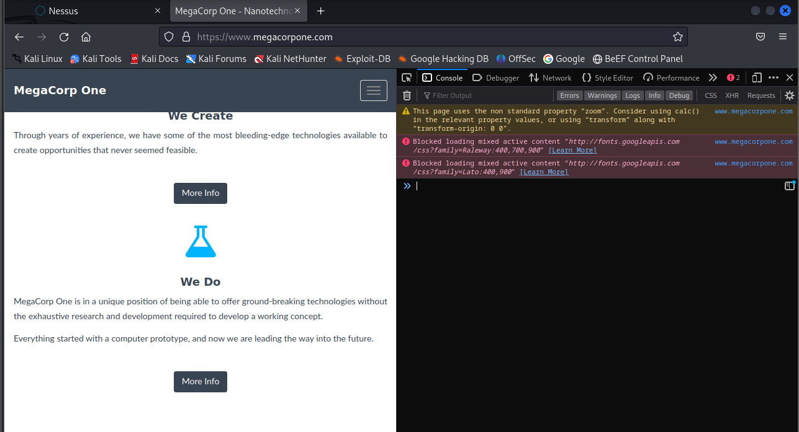
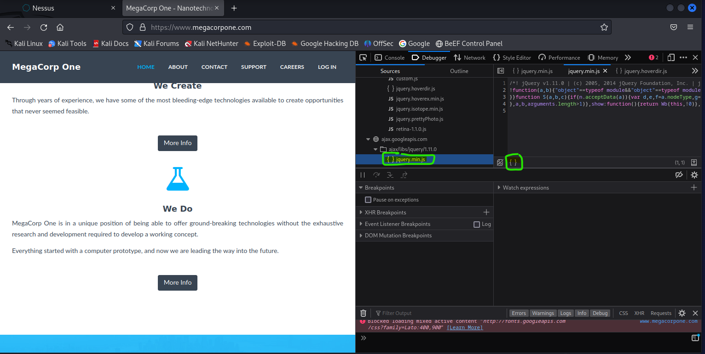
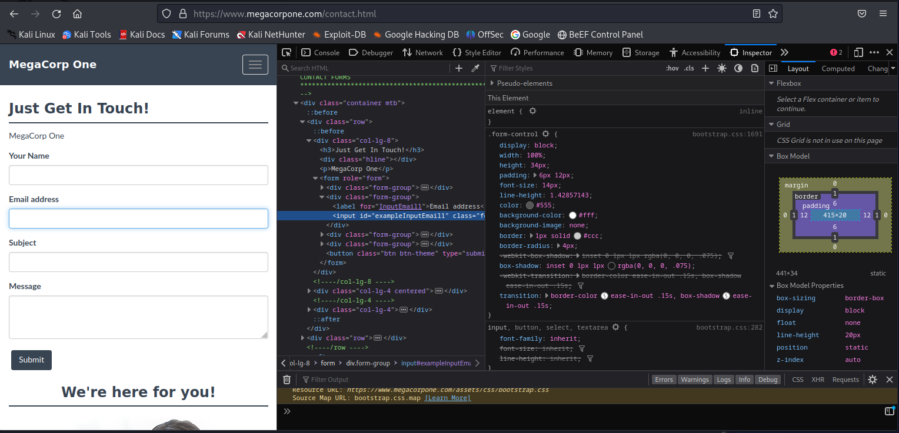
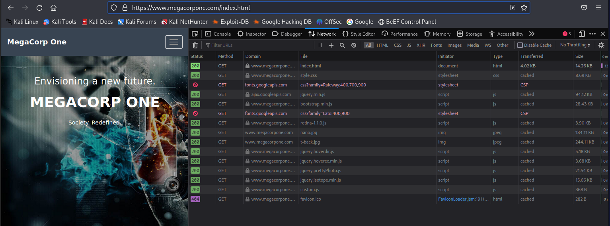
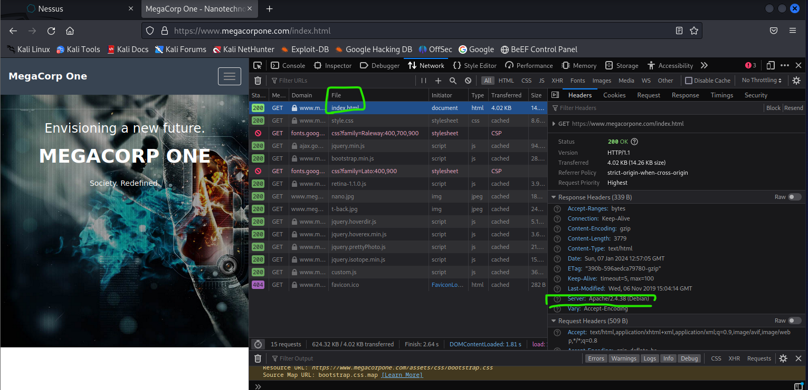

# Web app attacks
Offensive-Security-OSCP-by-Offensive-Security_2020 (PAGE; 240 - 248, part 1)
Current as in the future development frameworks and hosting solutions have simplified the process of the building and deploying web-based applications. These applications usually expose a large attack surface because of a lack of mature application code, multiple dependencies and insecure server configurations.

Web applications can be written in a many variety of programming languages and framework e.g. nodejs, react and ect. each of which can introduce specific types of vulnerabilities. Most vulnerabilities are similar in concept, regardless of the underlying technology stack.

The attack vectors will server as basic building blocks as used to construct more advanced attacks.


## Web app assessment methodology
Before start doing basic web app penetration testing methodology. At first, gather information about the application. What does the application do? 

What language is it written in? What server software is the application running on? The answers to  these and other basic questions will help guide us towards our first (or next) potential attack vector

Many of penetration testing steps, the goal of each attempt attack or exploit is to increase the permissions within the application or pivot to another application or the target.  Each successful exploit along the way may grant access to new functionality or components within the application. It may need to successfully execute several exploits to advance from an unauthenticated user account access to any kind of shell on the system.

Enumeration of new functionality is important each step of the way especially since attacks previously failed may succeed in a new context. As the penetration tester must continue to enumaret and continue adapt until got exchausted all attacks avnues or compromised the system.

<hr> 

## web app enumeration

Identify the components that make up a web applications before attempting to blindy exploit it.  Many of the web application vulnerabilities are technology-agnostic. Sort of exploits and payloads need to be crated based on the technological underpinnings of the application, such as the database software or operating system. Before trying to do any attacks on a web application, should  attempt to discover the technology stack in use, which generally consists of the following components;
- Programming language and frameworks
- Web server software
- Database software
- Server operating system

There exist several techniques that can use to gather this information directly from the browser. Most modern browsers include developer tools that can assist in the enumeration process. Like focusing on firefox browser sincie it is the default software in the Kali Linux.

## Inspecting URL(s)

file recognition, which are sometimes a part of a URL-path, where can reveal the proggramming lanaguage the applications is written in. Sort of as like .php are straightforward, but other extensions are more cryptic and vary based on the frameworks in use. E.g. a java-base web application might use .jsp, .do or .html format.

File recognition on web pages are becoming less common since many languages and frameworks now support the conpect of the routes, which where allow developers to map a URI to a section of code.

## Inspecting Page Content


At URL inspection can provide some clues about the target from the web applications, most context clues can be found in the source of the web page. At Kali Linux default browser is Firefox so open inspect will debbuger tool click by menu or by pressing "CTRL" + "SHIFT" + "K". It will display Javascript frameworks, hidden input fields, comments, client-side controls within HTML , javascript and ect. 

But in reality if using Chrome or Edge browser most pressing on keyboard F12 or just mouse right click and open "inspect".



Just check the application running on www.megacorpone.com uses jQuery version 1.11.0, which is a commong JavaScript library. In this case, the developer minifield the code, making it more compact and conserving resources but it will making it somewhat difficult to read. 

Down there is small green circle it will make the code more readable and prettify so within by click the "Print" source with the double curly braces;



Also can use the "Inspector" tool to drill down into specific page content. Like using mouse point to email input elements or other text inputs and click by right-clicking and show "Inspect". It will show as index.html or other html edition where can find out of this code from the code scripts.

 The Inspector tool and highlight the HTML for the element we right-clicked on


## Viewing Response Headers

Also can get research server responses for additional information. There are two types of tools what can use to accomplish this task. The first type of tool is a proxy, which intercepts requests and responses between a client and a webserver. The Firefox Web Developer menu, to view HTTP requests and responses. This tool shows network activity that occurs after it launches, so we must refresh the page to see traffic.

From Inspect and cateogires "Network" and select "All". Where can click on a request to get more details about it, in this case the response headers:



The “Server” header displayed above will often reveal at least the name of the web server software. In many default configurations, it also reveals the version number.



## Inspecting Sitemaps
Web applications can include sitemaps files to help search engine bots crawl and index their sites. As files included directives of URLs not to crawl. These are usually sensitive pages or 
administrative consoles–exactly the sort of pages we are interested in. The most common sitemap of two filenames are robots.txt and sitemap.xml

For example try at reality Chrome or Edge browser web tab and can see robots.txt files. <br>
https://www.google.fi/robots.txt <br>
https://www.google.fi/sitemap.xml <br>
https://www.megacorpone.com/robots.txt <br>

Or if like using command line as Kali Linux and it will show the files;
```
└─$ curl https://www.google.com/robots.txt
User-agent: *
Disallow: /search
Allow: /search/about
Allow: /search/static
Allow: /search/howsearchworks
Disallow: /sdch
Disallow: /groups
Disallow: /index.html?
Disallow: /?
Allow: /?hl=
Disallow: /?hl=*&
.....
```

"Allow" and "Disallow" are directives for web crawlers indicating pages or directories that "polite" web crawlers may or may not access. The listed pages and irectories are most cases may not be interested and some may even be invalid, sitemap files should not be overlooked as they may contain clues about the website layout or other interesting information.

Another example
```
┌──(kali㉿kali)-[~]
└─$ curl https://www.google.com/sitemap.xml
<?xml version="1.0" encoding="UTF-8"?>
<sitemapindex xmlns="http://www.google.com/schemas/sitemap/0.84">
  <sitemap>
    <loc>https://www.google.com/gmail/sitemap.xml</loc>
  </sitemap>
  <sitemap>
    <loc>https://www.google.com/forms/sitemaps.xml</loc>
  </sitemap>
  <sitemap>
    <loc>https://www.google.com/slides/sitemaps.xml</loc>
  </sitemap>
  <sitemap>
    <loc>https://www.google.com/sheets/sitemaps.xml</loc>
  </sitemap>
```

