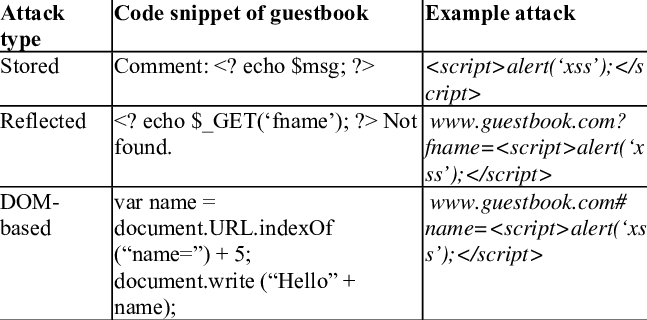
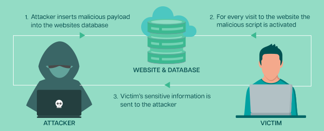
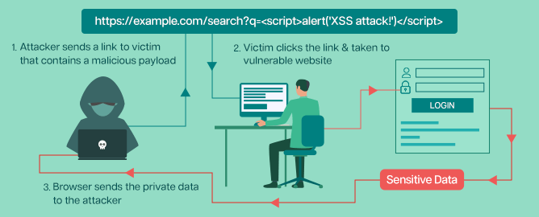

# Cross-Site Scripting (XSS)
<!-- Offensive-Security-OSCP-by-Offensive-Security_2020 page: 297 - 312 & some theory and memo from other pages-->

One of the important features of well-defended web application is a data sanitization ( the secure and permanent erasure of sensitive data from datasets and media to guarantee that no residual data can be recovered even through extensive forensic analysis). 

Which a process in which user input is process, removing or transfoming all dangerous characters or stings. Unsanitized  data allows an attack to inject and potentially execute malicious code. When this unsanitized input is displayed on a web page, this creates a Cross-Site Scripting (XSS) vulnerability.

XSS though was elatively low-isk vulnerability, but today as in the future is both high-risk and prevalent, allowing attackers to inject client side scripts as JavaScipt into web pages viewed by other users.

Cross-Site Scripting got few types as e.g. Non-persistent (reflected), Persistent (or stored) and DOM-based (in client-side code).



- Stored XSS attacks is another name as Persistent XSS, occurs when the exploit payload is stored in a database or else cached by a server. The web application will retrieves this payload and isplays it to anyone that views a vulnerable page(s).  A single Stored XSS vulnerability can therefore attack all users of the site. Stored XSS vulnerabilities often exist in forum software, especially in comment sections, or in product reviews.

Stored XSS attacks involve injecting malicious code into a web application’s database that is then displayed to other users who view the affected page. For example this can be happening when a web application allows users to post content, such as comments or messages, stored in the database and displayed to other users.



If an attacker can inject a script tag or other malicious code into their own content, it will be stored in the database and executed by the browser when other users view the affected page.

An attacker could post a comment that includes a malicious script;
`<script>alert(‘XSS attack!’)</script>`

- Reflected XSS attacks include the payload in a crafted request or link. The web application will takes this value and places it into the page content. This variant only attacks the person submitting the request or viewing the link. Reflected XSS vulnerabilities can often occur in search fields and results, as well as anywhere user input is included in error messages.

For exampe this can be happen when a user submits a form with a search query or other user input, and the web application includes that input in the response without proper validation or sanitization.



If an attacker can inject a script tag or other malicious code into the user input, it will be reflected by the user and executed by the browser.

Fo example attacker could construct a URL includes a malicious script.
`https://example.com/search?q=<script>alert(‘XSS attack!’)</script>`
  
- DOM-based XSS attacks are similar to the other two types (Stored and Reflected XSS), but take place solely within the page’s Document Object Model (DOM).  The browser
parses a page’s HTML content and generates an internal DOM representation. JavaScript can programmatically interact with this DOM. In other words a DOM-based XSS attack, the malicious data does not touch the web server. Rather, it is being reflected by the JavaScript code, fully on the client side.

For example: web page includes JavaScript code will sets the value of an input field based on a query paameter, an attacke could construct a URL that contains a malicious script. <br>

`https://example.com/page.html#input <script>alert(‘XSS attack!’)</script>`

This variant occurs when a page’s DOM is modified with user-controlled values. DOM-based XSS can be stored or reflected. The key difference is that DOM-based XSS attacks occur when a browser parses the page’s content and inserted JavaScript is executed.

Regardless of how the XSS payload is delivered and executed, the injected scripts run under the context of the user viewing the affected page.

<hr>

## Identifying XSS Vulnerabilities

Finding potential entry points for XSS by examining a web application and identifying input fields (such as search fields) that accept unsanitized input which is displayed as output in
subsequent pages.

When identify an entry point, it can input special characters, and observe the output to see if any of the special characters return unfiltered.

The most common special characters used for purpose include; `< > ' " { } ;` as special characters for HTML and JavaScript

## Basic XSS

This is like former when practices/demonstrate within Badstore (small repeat) what this XSS is meaning and although of course there is other tools practices with Kali Linux, not just Badstore.

On kali linux xss tool like <b>Beef-xss</b> or just add some input field give a small script and this can found on linux path `/usr/share/wordlists/wfuzz/Injections`

```
┌──(kali㉿kali)-[/usr/share/wordlists/wfuzz/Injections]
└─$ head XSS.txt 
"><script>"
<script>alert("WXSS")</script>
<<script>alert("WXSS");//<</script>
<script>alert(document.cookie)</script>
'><script>alert(document.cookie)</script>
'><script>alert(document.cookie);</script>
\";alert('XSS');//
%3cscript%3ealert("WXSS");%3c/script%3e
%3cscript%3ealert(document.cookie);%3c%2fscript%3e
%3Cscript%3Ealert(%22X%20SS%22);%3C/script%3E

```


