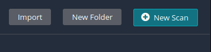
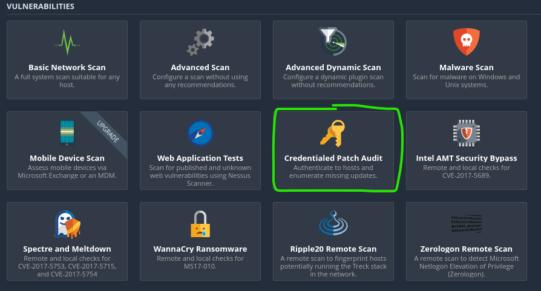
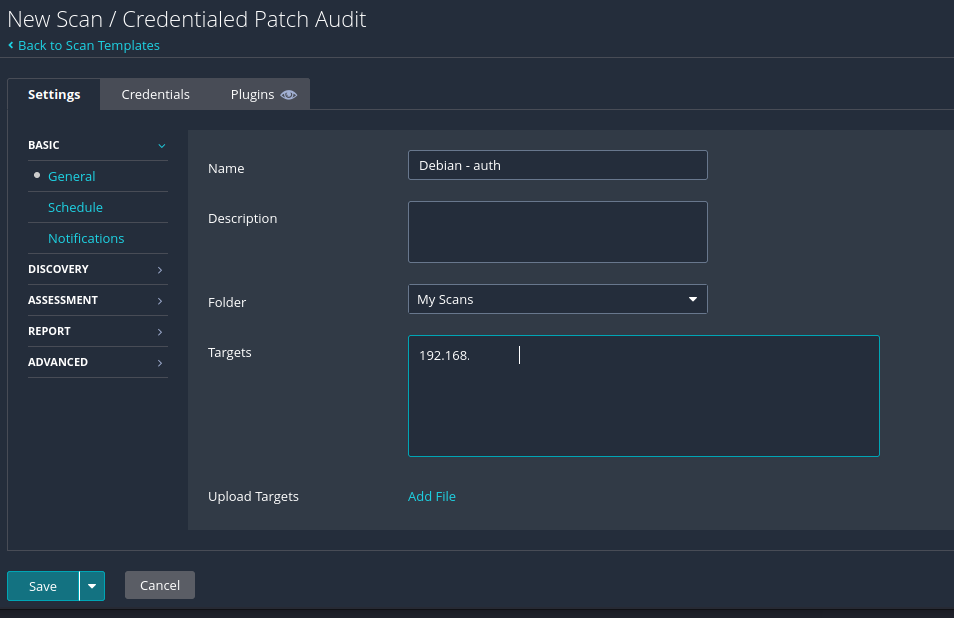
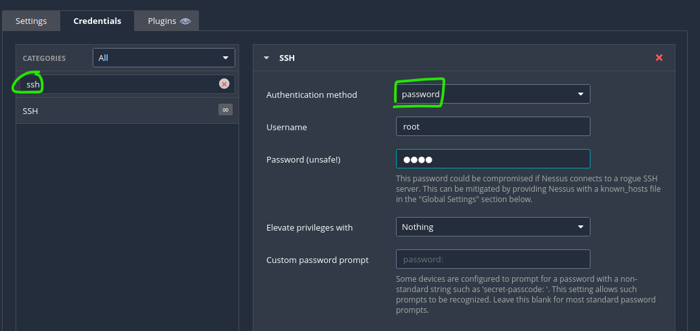
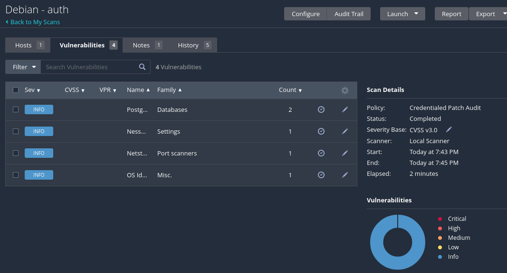

# Todentamattomia tarkstuksia
Unauthenticated scanning with Nessus

/Offensive-Security-OSCP-by-Offensive-Security_2020 (PAGE: 222 - 226)

Tässä harjoituksessa ei pysty virallisesti testaa kauheasti mitään, koska ei ole virallista labroatoriota ja kuinka skannaisi haavoittuvuutta, mutta testatu kuitenkin "Badstore" kautta ja siinä tulostui ainakin jotakin

  
  

  
  

  
  
