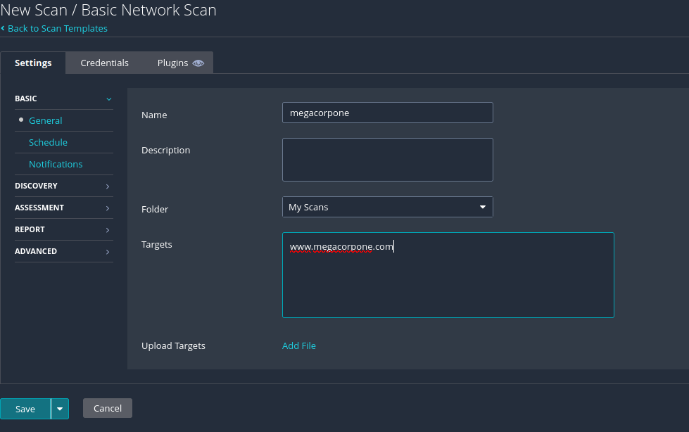
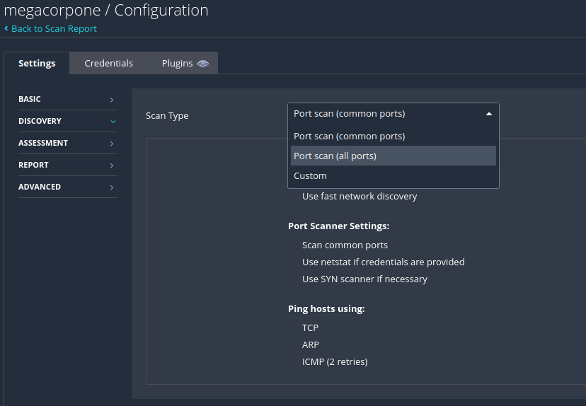
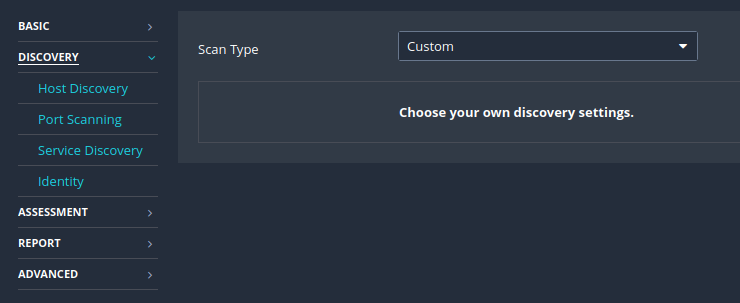
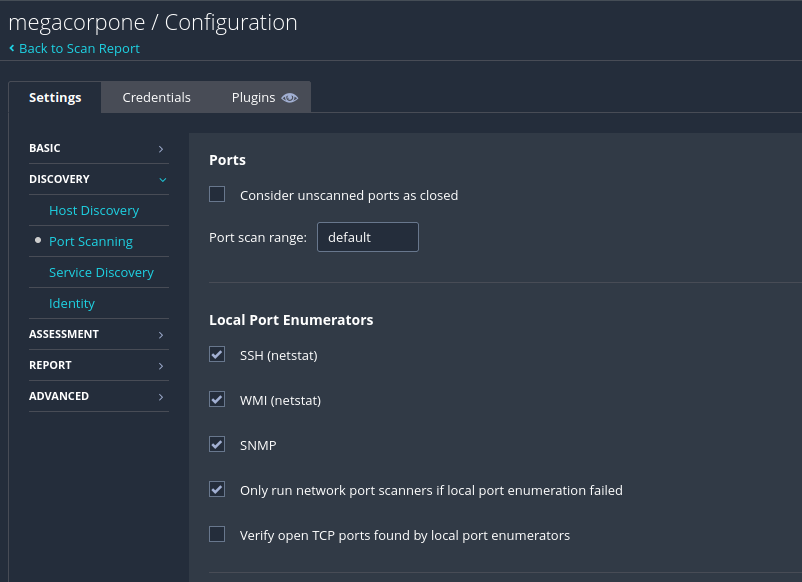

# pieni Teoria ja huomiota

Configuring Scan Definitions - skannauksien määrittelmiä

Usein skannauksessa valitaan joku pohja niin mennään esikonfattujen oletusasetuksilla. Usein oletusasetukset eivät ihan välttämättä anna oikeetta skannausta ja on otettava huomioita ympäröivän alueen, aikana rajoitukset ja tarkistettava kohdetta. Joitakn asioissa, jotka on otettava huomioon määrittäessä mm. verkkon skannauksen template sisältyen tai niitä tiettyi tekijöitä;

- Are our targets located on an internal network or are they publicly accessible?
- Should the scanner attempt to brute force user credentials?
- Should the scanner scan all TCP and UDP ports or only common ports?
- Which checks should the scanner run and which ones should it avoid?
- Should the scanner run an Authenticated Scan or an Unauthenticated Scan?

Tässä ranskalais viivattua tarkistustan varten voidaan suorittaa ensimmäisen perus porttien skannausta KAIKKISTA portista. Oletuksena verkon skannauksena kannattaa skannata vain yleisiä portteja.
Eli jos avaa Discovery - ikkunan puolen

Discover - välilehdestä, ja scan type: josta voi valita muita vaihtohtoehtoja mm. on port scan (common ports), port scan (all ports) tai custom.

Kun otettaan "custom" valikkoa, josta jonka jälkeen "Discovery" kategorian alle ilmestyy "Port scanning" valikkoa, josta konfiguroidaan ja määritettään tcp/upd olemassa olevia porttien määrää

Port scan range , usein on oletuksena, mutta scannattaan koko tcp/udp olemassa olevat kaikki portit eli 0-65535

Sitoutumisen ajalla on kuitenkkin punnittaa kohteen verkkon vakautta, kohteen laajuutta, sitoutumisen kestoa ja monia muita tekijöitä porttienskananuksien vaihtoehtoja määrittäessä.

Skannauksen määrityksen konfigurointien ajalla ei voida vain konfiguroida mitään tunnnistetietoja, mikä tarkoittaa, ettei tämä tarkituksen skannaus ole todentamatta. Jos tarkistaa muita vaihtoehtoja Basic Network Scan - platformista, voidaan varmistaa, että tarkitus suorittaa yleisiä tarktuksien kohteita suhteen toisin kuin muut mallit ko. Spectre ja Meltdown, johon sisältävät erityisiä haavoittuvuuden tarkituksia.

Pien huomio, määritetty tarkitus on erittäin havaittavissa verkkoliikenteen tasolla, koska se tarkistaa kaikki portit ja etsii kaikkia soveltuvia haavoittuvuksia.

