# harjoitus skannaus
esim. harjoitus skannattaan perus verkon skannaus (basic network scan), joka skannaa koko järjestelmän skannattujen haavoittuvuutta koko host:ista 

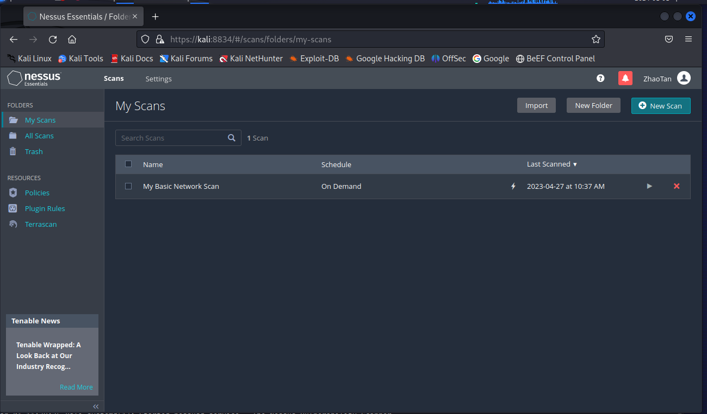
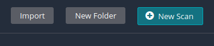
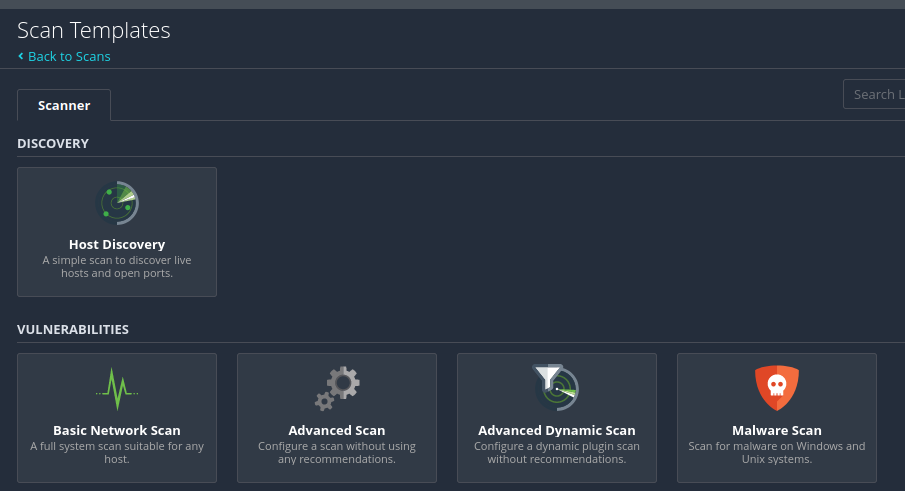

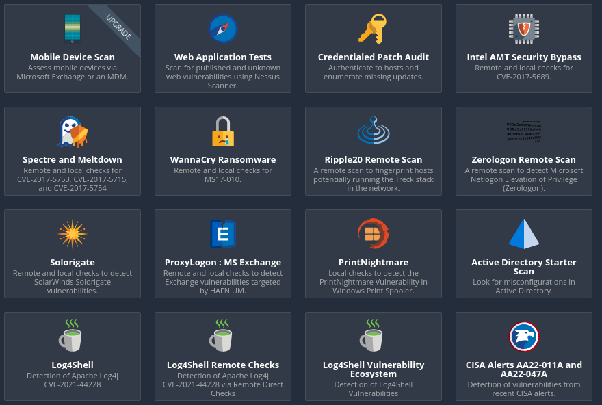

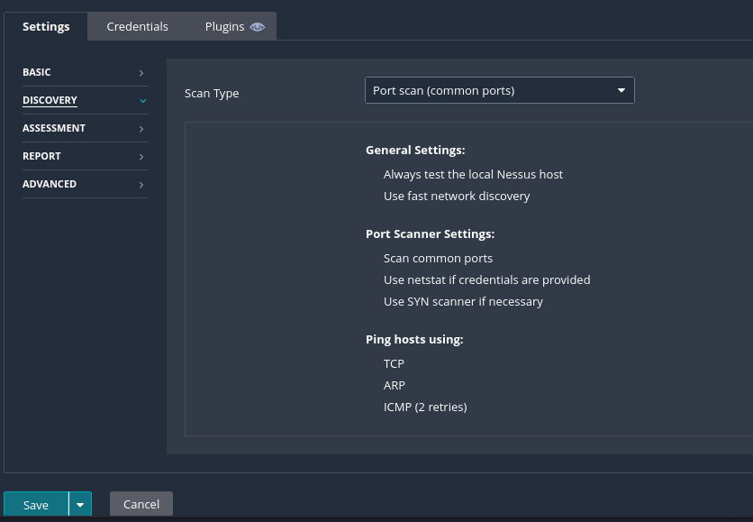

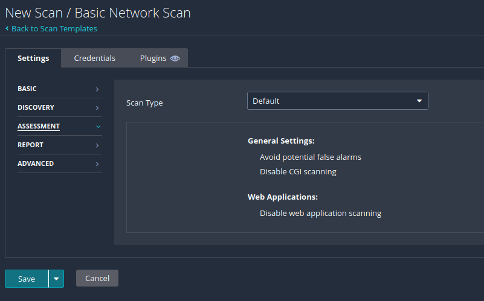
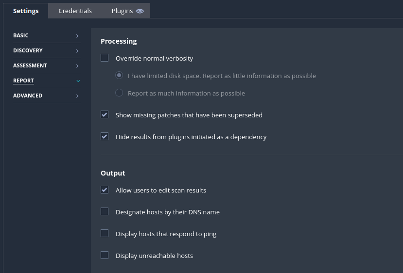
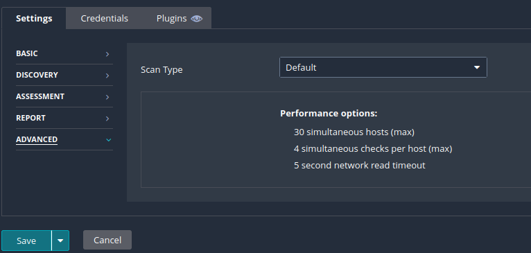

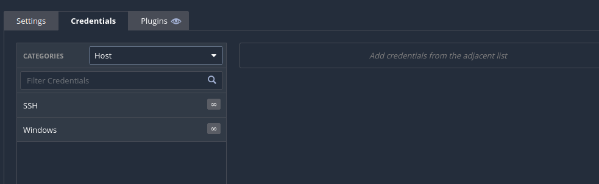
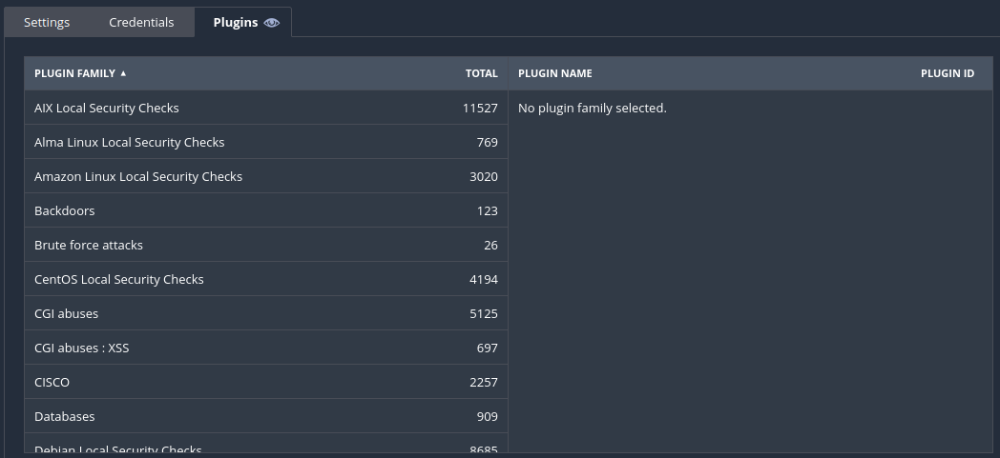
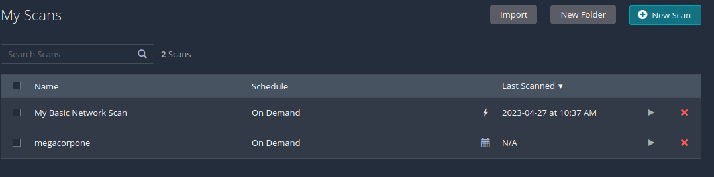

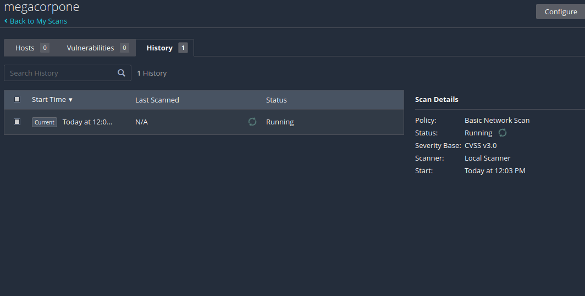
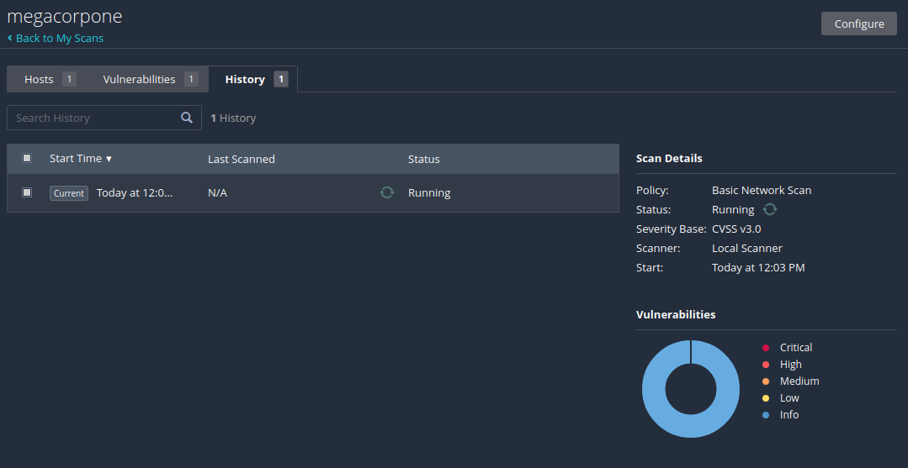
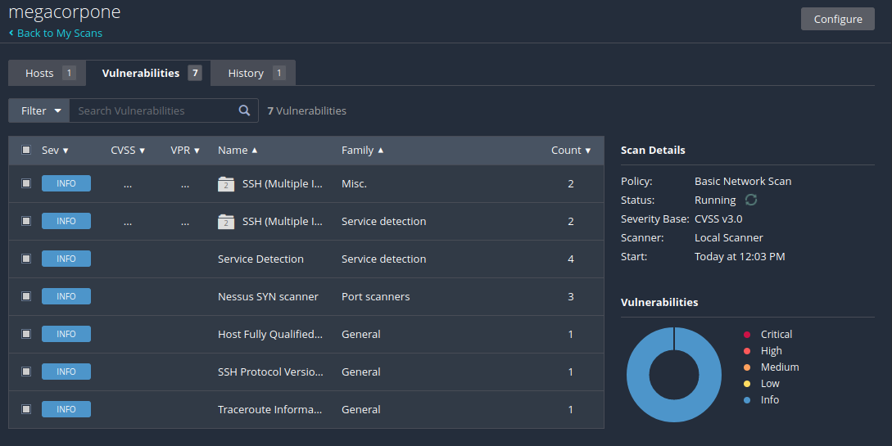

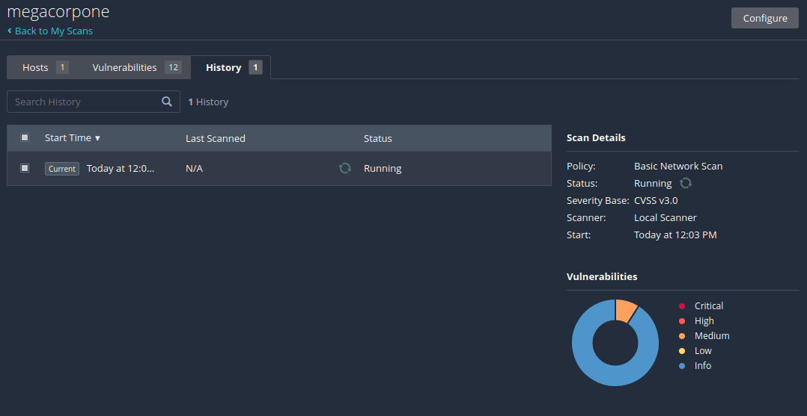
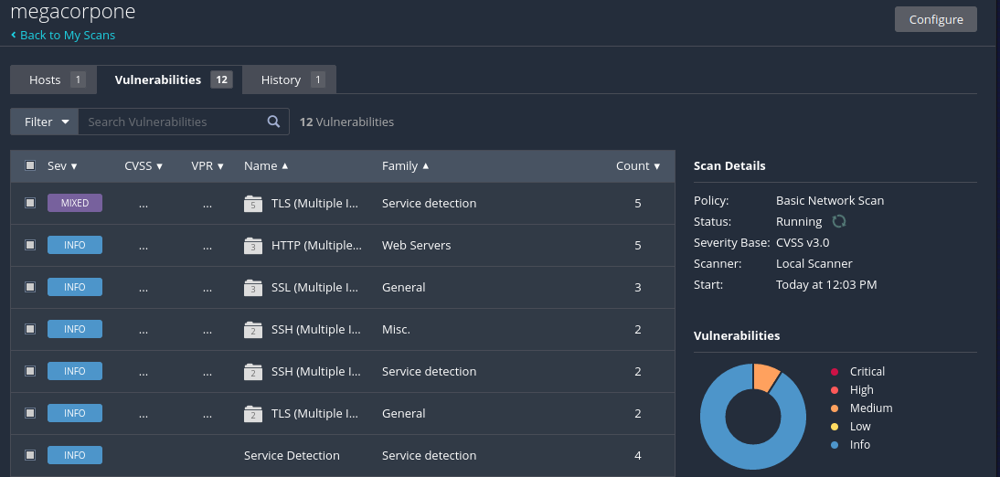
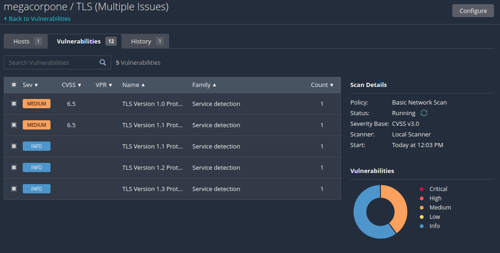

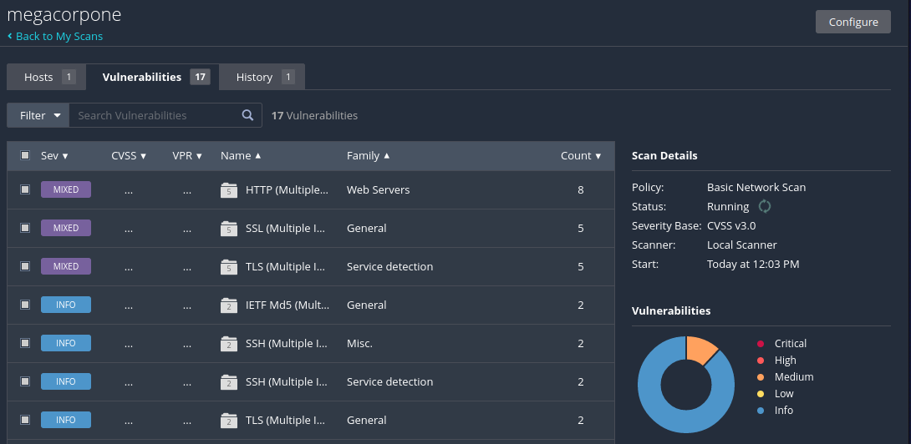
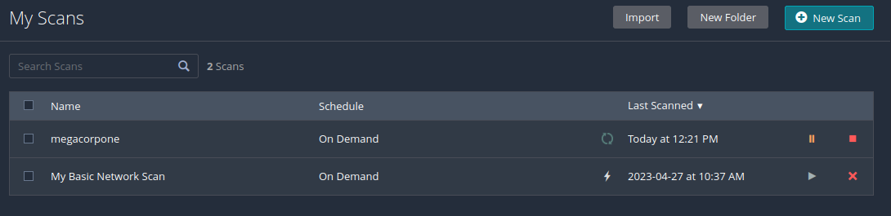
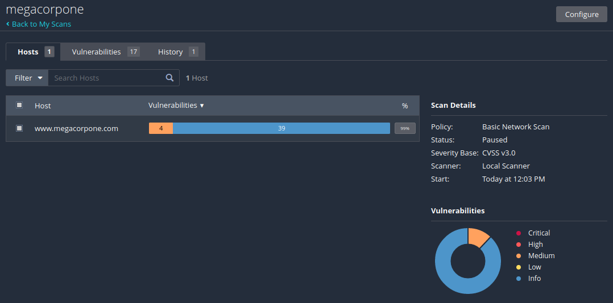

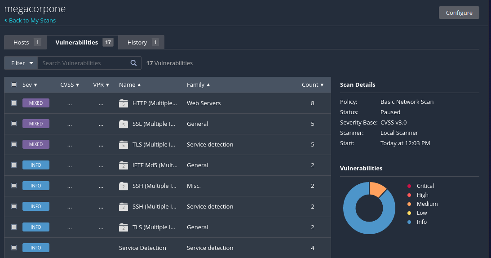
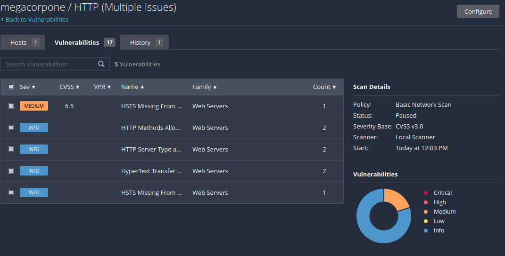

