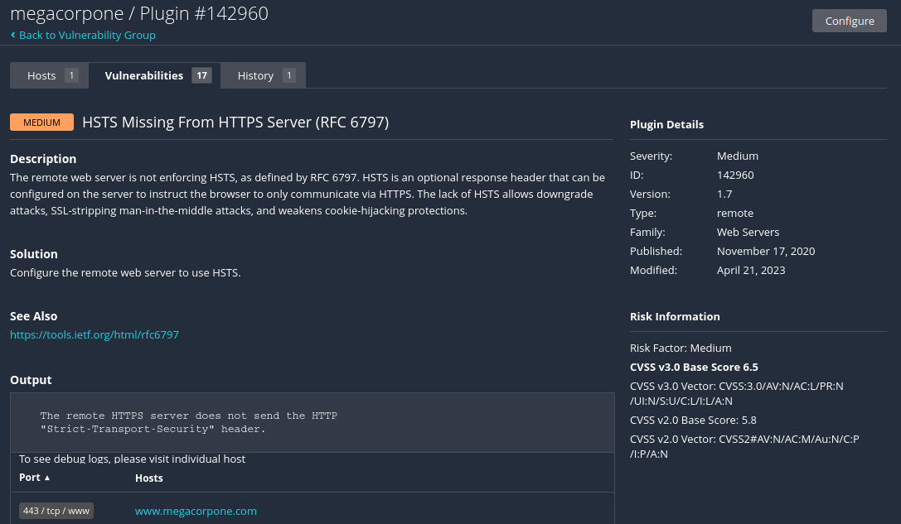

# harjoitus skannaus
esim. harjoitus skannattaan perus verkon skannaus (basic network scan), joka skannaa koko järjestelmän skannattujen haavoittuvuutta koko host:ista 

Ensimmäisen oletus sivusto ja näkymä  

New scan - suoritettaan uutta skannausta mm. webbi sivuston haavoittuvuutta, haittaohjelman skannausta, mobiililaitteiden skannausta, webbi sovelluksien testausta ja jnne, periaatteessa valitaan uusi template skannaus pohja.  
  
  

Harjoituksessa valitiin (Basic network scan), josta skannattaan kohdetta eli targets kentään (www.domain.com) & sekä valinnaisena saa määrittää tiettyjä asetuksia ja ominaisuuttta ja muita raporttia.  
  
  
  

  
  
  

  
  

Mikäli on valmis eli asetukset on ok ja jne, niin muista tallentaa, jonka jälkeen automaattisesti viee tonne "My Scans" alle, josta näkee kaikki omat skannaukset (historiat). 
Ihan oikealla on aktivointi ja stop nappi, eli joko aloitettaa/jatkaa skannauksen kyseisen kohteen ja/tai keskeytettään suorituskyky.  

Historian skannauksesta voi nähdä koska ja milloin suoritettu se skannauksen toiminta esim. ma skannattu, sitten myöhemmin skannaa taas, ja skannauksen tarkempaa lisätietoa esim. status jossa lukee suorittaa sen suorituskyvynsä. Seuraavassa kuvassa alhaalla näkyy erillisenä (donitsi) kuviona, että löytyi haavoittuvuutta (vulnerabilities), ja minkä tasoisia.  
  
  

Sama kuin edellinen kuva, jossa on donitsi kuva, ja tähän kategoriaan tulokseen tulee kaikki suorituskyvyn löydetyt ja skannatut haavoittuvuudet. Tuloksena tulostuu aivan kaikki eli priorisoitu matalasta korkeampaan tasoon että info.  
  

Odota joko pari-muutama minuutti, niin sieltä tulee jokin pieni matala priorisoitu haavoittuvuus tulos (donitsi rengas) tulostuksesta. Haavoittuvuuden kategoriasta voi tarkistella ja nähdä, mitä skannauksien tulostuksia se on löytänyt. Skannauksesta saattaa mennä useampi minuutti, koska skannauksessa tuottaa viivettä ja aikaa, että löytää sen haavoittuvuuden.  
   
  

Oranssi värinen haavoittuvuus ja priorisoitu "medium" tasoksi.  
  

  

Keskeytin itse ton skannaukse (oikea toiseksi) nappista, koska katsellaan viimeisimpien tulosta ja mitä skannauksen tulostusta on löytynyt.  
  

Pieni yhteenveto, että mitä skannausta on löydetty tähän menessä (sen muutaman minuuttin aikana). Tuloksena löytyi 4 medium ja muut ovat info tyyppejä. Jos tarkennettaan vähä lisää..  
   

Valitaan se ensimmäinen vaihtoehto (violetti "mixed")  
  
  

Haavoittuvuudesta löytyi tämmöinen tekijä eli HSTS mising From HTTPS Server  
  

