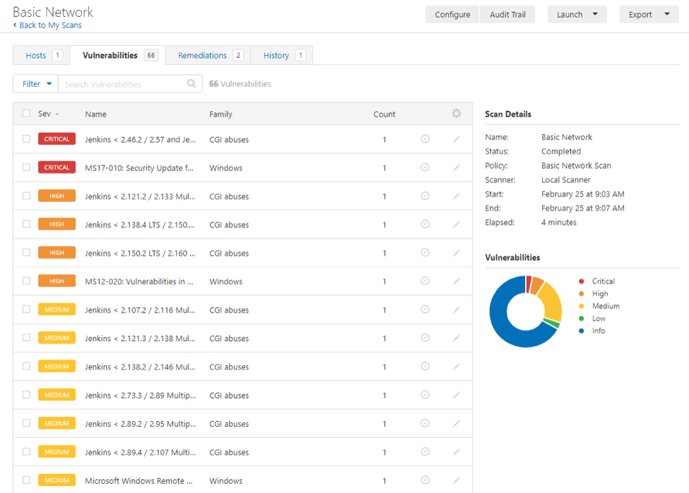
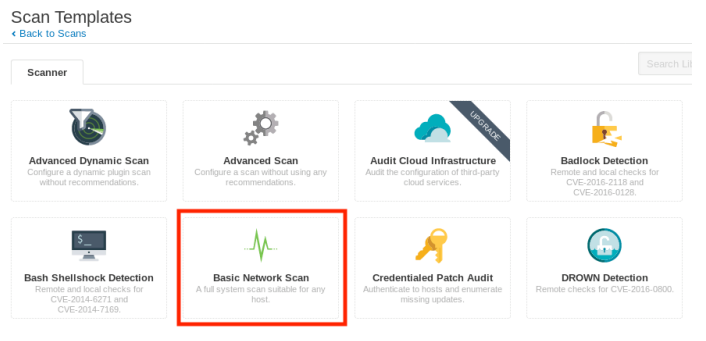

# Nessus

Ohjelmistosovellu, jossa vaadittaan sisään kirjautumista sallii ohjelmiston käyttöä eli tunnuksia sisään ja nessus on oma haavoittuvuuden skanneri. 

Esim. haavoittuvuuksista ja altistumisesta, josta Nessus voi etsiä mm;
- haavoittuvuuden, jotka voivat sallia luvattoman hallinnan tai pääsyn johonkin järjestelmän arkisto tietoihin
- virheellisiä määrityksiä kuten avoimet sähköpostit, puuttuvia korjaustietoja ja jne.
- oletussalasanat (admin : secret) tai muutamia yleisiä salasanoja ja tyhjiä/puuttuvia salasanoja joillakin järjestelmillä. Myös yleisiä helppoja salasanoja vaikappa: password, admin, admin123, 1234 ja jne. Nessus voi myös kutsus Hydran (ulkoisen työkalua) käynnistäkseen sanakirjanhyökkäyksen.
- Palvelun DDos hyökkäyksien haavoittuvuuksia kieltäminen.

Nessus periaatteessa skannaa kattavia laajan valikoman tekniikoita mm. käyttöjärjestelmät, verkkolaitteet, hypervisorit, tietokannat, verkkopalvleimet ja kriittisiä infrastruktuuria. 

Skannauksesta voi olla url linkki joko http tai https - protokolla (http://name.fi) tai kohteen IP-osoite. Harjotuksen kanssa jos harjoittelee tiettyä sovellusta hakkerointiin niin on oman koti/työpaikan lähempänä sitä IP-osoitetta eli alkuun just 192.168.X.Y jotakin, koska käyttää just sitä DHCP:tä.

* [Pien huomio latauksesta ja startup](#pien-huomio-latauksesta-ja-startup)

## Pien huomio latauksesta ja startup

Nessus asennusohjeesta löytyy pientä tarkennusta, että kuinka asentuu. Pieni huomiona kevät 2023 mennään versio 10.x.y jotakin ja se ei tykkää google gmail sähköpostia jotain syystä, kantsii kokeilla jos täydentää omalla työsähköpostilla (esim. vale työsähköposti...)

Nessusta asennettaan virtualikoneen vmware:n sisäisen kali linux ympäristön sisään eli kantsii ensimmäisenä kirjautua kali linux:sen sisään, niin sieltä lataa sitä nessus sovellusta.

## komennot

`systemctl <start|stop> nessusd`

## scannaus

Nessus tekee useita skannauksia ja eri tyyppisiä mm.
-  Basic Network Scan: Generic scan with various checks that are suitable to be used against various target types.
-  Credentialed Patch Audit: Authenticated scan that enumerates missing patches.
-  Web Application Tests: Specialized scan for discovering published vulnerabilities in Web Applications.
-  Spectre and Meltdown: Targeted scan for the Spectre and Meltdown vulnerabilities.

Nessus tukee kohteen lisäämistä IP-osoitteena, IP-alueena tai pilkuilla eroteltuna FQDN- tai IP-luettelona.

