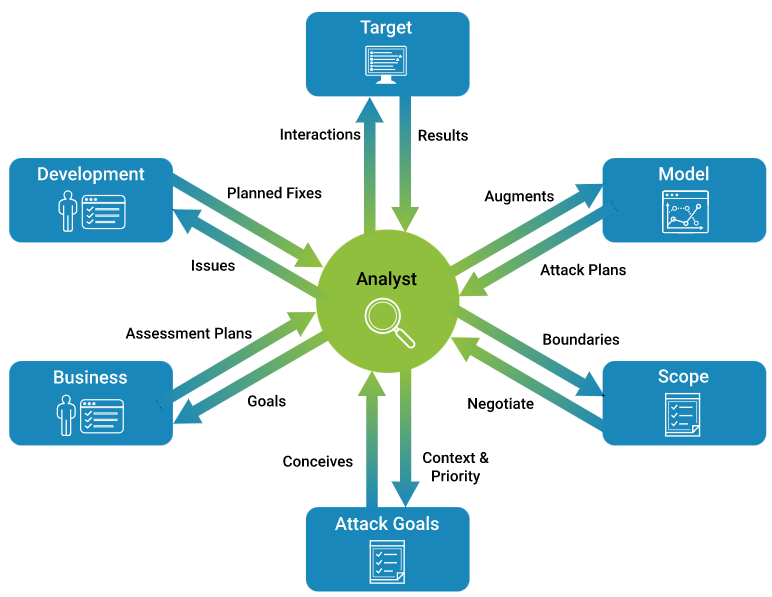
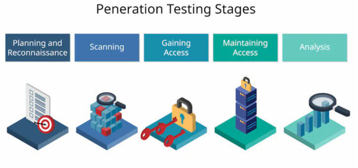
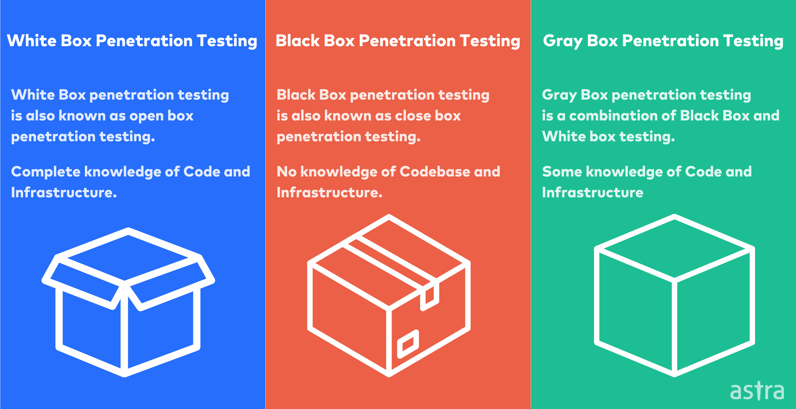
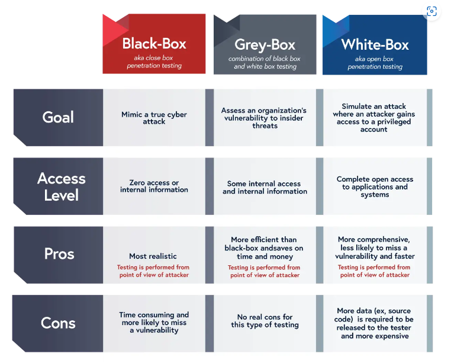
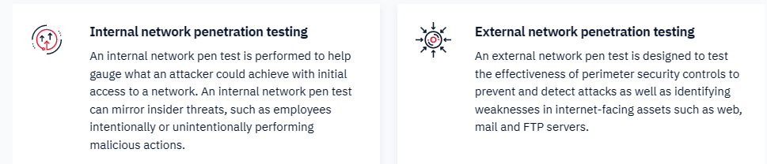

# Kali Linux

On käyttöjärjestelmä OS (operating system), joka on suunniteltu tekniseen rikostutkintaan, penetraatiotestaamiseen ja paljon tietoturvaan ja sen testausta liittyviä ohjelmia, vähä mm. salapoliisi työtä, porttiskannausta ja myös suositeltava aloittavien hakkerointi väline. Paketti pohjaan on mm. ohjelmistona wireshark, metasploit, linux komentojen nmap, wfuzz, nikto, mysql ja jne, myös kali linux root itsensä.

Kali linux järjestelmässä on mukana mm. firefox selain, wireshark ja jne. että hyödyntää käyttäjän vaikappa tietoliikenteen yhteyden pelittämistä, skannausta tcp/udp protokollaan. Jos yhtäkkiä lataa tiettyä sovellusta, niin katsii ennen sitä tarkistaa esim. super hausta, että mahtaako olla tämmöinen tietty x sovellus jo olla mukana tässä järjestelmän paketin sisällä ennen kuin lataa sitä varsinaista versiota.

Kali linux:sta voi käyttää virtuaalikone pohjaista sovellusta mm. vmware, virtualbox tai fyysisen WSL (Windows Subsystem for Linux) eli microsoft pohjaan ja jos mac osaan tulee maksulliseksi. Suositeltavina lataa virtuaalikone pohjan, josta upottaa ladatun kali linux tiedoston ja josta sen jälkeen suorittaa/aktivoi sen kali linux ympäristön. Saa mm. usb tikullakin ladatua kali linux:sta, että esim. vähä rikollista ja riskiä käyttäjälle jos suorittaa selaisen prosessin.

- [Penetraatiotestaus](#Penetraatiotestaus)
  * [työkalut](#työkalut)
  * [types testing](#types-testing)
  * [color boxes types](#color-boxes-types)
    * [external vs internal](#external-vs-internal)
      
- [cyber security tools](#cyber-security-tools)
- [hakkeri typpejä (hattu väri)](#hakkeri-typpejä-hattu-väri)
- [muita harjoituksia ja hyviä vinkkejä hakkerointiin:](#muita-harjoituksia-ja-hyviä-vinkkejä-hakkerointiin)
  * [pdf kirjoja](#pdf-kirjoja)

jos suorittaa kali linuxsta vmware:a pohjaan niin siinä on n. joko 14 tai 30pv kokeilu versiota, että saa siitä fyysisen kiinteä ikuisuuden versio pohjanki itselle ja siihen pitää liittää se lisenssi koodi. Tätä lisenssi koodia löytyy usein github kanavista, että säästyy rahaa aika paljon ja riippuu aikooko päivittää sitä virtuaaliympäristön työkalua eli vmware:a.

Vaihtoehtona pyörittää virtualibox, että sekin toimii ilmaisena. Myös huomiona kali linux käyttöjärjestelmä paketti on n. 2.7Gb tilaa dataa jos suorittaa 64-bittisellä versiolla, että viee paljon tilaa..
 
 
Ladattavina kali linux; https://www.kali.org/get-kali/#kali-platforms  
Kali linux sisäiset työkalut; https://www.kali.org/tools/   

ensimmäisenä kantsii muuttaa linux:sen näppäimistö asetukset eli riittää avaa komentorivin ja syöttää;;   
┌──(kali㉿kali)-[~]   
└─$ setxkbmap fi    

# Penetraatiotestaus

Penetraatiotestaus eng. penetration testing

Tarkoittaa tietotekniikan tietojen murtautumista, tunkeutumista tai läpäisyä. Tietojärjestelmien ympäristössä termi tarkoittaa tietojenmurtoa suojattuun tietojojärjestelmien ulkoverkon kautta (Blackbox). Testaamisesssaa ei voi yritetä todentaa, että voidaanko löydettyjä haavottoivuuden vuoksi käyttää ja testaamisessa kuuluu murtotestauksen piiriä.

Penetraatiotestauksessa käytetään tietojärjestelmien suojausmekanismia heikkouden ja haavoittuvuuden havaitsemista. Testauksessa tavoitteena on saada riittävä varmuus tietojärjestelmien suojausten asianmukaisia ja todennusta ulkoverkosta tulevia hyökkäyksiä vastaan. Testauksessa on eräänlaisia tietoturvatarkastuksia, jolla varmistellaan ohjelmiston suojausta joko ennen tuotannon siirtymistä tai osa jatkuvista yleisistä riskinarvioinnista.

Testin tarkoituksena on kertoa yrityksille/organisaatiolle nykyisen kyberturvallisuudenprotokollien vahvuuksia, jotta tuottaa esiin mahdollisia heikkouksia, joihin hyökkäyksiin voidaan käyttää hyväkseen heikentämällä ja tunkteutukanseen asiakkaan (yrityksen) tai käyttäjään IT-järjestelmiin. Yrityksen tulee tehdä penetraatiotestiä säännöllisesti varmistakseen, että infrastuktuuri pysyy vahvana ja hyvin suojattuna. Tietoturvanloukkaukseen voivat suerata ilkivaltaisia hyökkäyksiä, järjestlemähäiriöitä tai inhimillisiä/vakaavi virheitä. Tärkeännä on tunnistaa riskit ja paljastaa järjestelmien heikkouksia, joita ei ehkä ole edes mietitty tai ajateltu, koska ei tietoa koska tämmöinen tulee vastaan tulevaisuudessa.

http://www.secmeter.com/penetraatiotestaus.html

Testauken ja sen analysointia:
Ennen alkavien projektien aikataulutusta ja mitoittamista asiakkuuden kanssa, niin kantsii tutustua tärkeät dokumentteihin. Automaattisen skannausten jälkeen tekee tiedustelutyön ja lopuksi manuaalisen testauksen. Lopputuloksen on löydöksistä koostettun raportti, joka sisältää listauksen havaitujen haavoittuvuksista, sekä asiakkaan ladittujen tehtävälista haavoittuvuuksien mitigoimiseksi (pienentää ja vähentämiseksi), sekä yleisen tietoturvantason parantamista. Jos/Kun testaus on saatu onnistuneeksi päätöksestä ja asiakkuus on suoritanut suosituksen parannustyötä nii voi myöhemmin tulevaisuudessa tehdä uusintatestin.

## työkalut

työkaluja voi olla komentosarja tyyppiä ja tunnetuimista ovat mm. nmap, nikto ja jne, sekä työkaluista voi olla open source sovellusta, josta pitää suorittaa sen ohjelmiston latausta.

## types testing

Penetraatiotestauksessa yritettään hyödyntää järjestelmien, verkkojen, henkilöhallinnon tai fyysisien ominaisuuden heikkoutena tai haavoittuvuuksien turvallisuuden valvonnan tehokkuutta stressitestamiseksi. Testauksen tyyppejä on mm. verkkopalvelut, sovellukset, langattomat ja langallliset verkot, käyttäjien/sosiaalisen manipulointi (social engineering) ja fyysinen testaus. Testauksessa voi suorittaa ulkoisen tai sisäisesti erilaisissa hyökkäyksienvektorien simuloimisessa. 

https://purplesec.us/types-penetration-testing/

## color boxes types

Jokaisessa testauksessa on jokin tavoite rippuuen penetraatiotestaajasta tai ei ole aiempaa tietoa ympäristöstä ja järjestelmistä, että mihin he yrittävät hakea/rikkoa. Penetraatiosta on myös luokiteltu laatikko väri ja kuvaus mm. värinä musta, valko ja harmaa laatikko.

- Valkoinen laatikkoa - tausta- ja järjestelmätiedot toimitetaan testaajille etukäteen myös kutsutaan sisäisen läpäisytestaus (internal penetration testing), ja kaikki tiedot ja pääsyt lähdekoodiin ja ympäristöön. Tämän valkoisen laatikkon tavoitteena on tehdä yrityksen järjestelmien perusteellisen tietoturvatarkastuksen ja tarjota testaajille mahdollisimman paljon yksityiskohtaisia toimintoja. Myös seurauksena testit ovat perusteellisia, koska testauksena on pääsy alueilla, johon musta laatikko testaaja ei pääse, kuten koodin laatua ja sovellussuunnittelua. Huono puolensa esim. testauksen laitteen käyttönoikeustason huomioittava voi kestää kauemmin päättää jotakin asiansa, että mihin alueeseen keskitettyä. Myös tästä testauksen menetelmästä vaatii usein kehittyneitä ja kalliitta työkaluja, kuten koodianalysaattoria ja debuggointia eli virheenkorjauksia. Loppujen lopuksi ei väliä suorittaako valkoisen vai mustan laatikon testauksena, kunhan testin ensijainen tavoite on saavutettu.

- Musta laatikko - perustietoja, mikä tunnettaan parhaillaan ulkoinen testaus (external penetration testing), joka saa vain vähän tai ei ollenkaan tietoa yrityksen IT-infraskutuurista. Ehkä tärkein etuna on simuloida todellista kyberhyökkäystä, jolloin testaaja ottaa tietämättömän hyökkääjän roolin. Roolina testaus voi kestää jopa muutama viikon, joten se on yksi pisimmistä testauksen tyyppeistä. Yritykset riippuu hinnasta, mitä he odottavat testaajalta raportoivan suunnittellun, suorittamisen, testauksen ja täyttämistä liittyviä tietojen vaivaamista. Mahdollista yksi helpoimmista tavoista testaaja murtautuu järjestelmän testin aikana ottaa käyttöön useita toimivia hyötyjä mm. kerberos (todennusprotokolla ja toimii tietokoneverkossa). Methodin testauksen menetelmänä kutsutaan myös "trial and errors" (yritys ja virhe) lähestymistä, mutta löytyy korkea tekninen taito tähän prosessiin.

- Harmaa laatikko - kahden yhdistelmä eli valk ja mustan välillä, jossa on rajallinen tieto kohteesta ja jaettu tarkastajalle.
Tunkteutumisen tunnistaa järjestelmän haavoittuvuuden hyökkäykseen ja arvioimalla sen haavoittuvuutta. Se on osittain tieto tai pääsy sisäiseen verkkoon tai verkkosovellukseen. Testaaja voi aloittaa host konen käyttöoikeuksista, ja häntä kehotetaan eksaloimaan oikeudet verkkotunnukset domain järjestelmänvalvojalle (admin). Tai heitä pyydetään pääsemään ohjelmistosovellukseen koodiin ja järjestelmä arkkitehtuuri kaavoihin. Harmaan laatikon testauksen etuna on, että raportointi tarjoaa tarkemman ja tehokkaamaan arvion verkkoston turvallisuudesta. Esim. sijaan, että käyttäisivät aikaa "trial and error" kanssa. Testaaja, jotka suorittavat harmaan laatikon tunkeutumista testin, niin voivat tarkastella verkkokaavioita tunnistakseen suurimman riski alueita. Sama sieltä voi suositella asianmukaisia vastatoimia aukkoja täydenttämiseen.

https://www.packetlabs.net/posts/types-of-penetration-testing/  
https://www.getastra.com/blog/security-audit/types-of-penetration-testing/  
https://purplesec.us/types-penetration-testing/  
https://www.intruder.io/blog/types-of-penetration-testing  
https://securityboulevard.com/2022/08/types-of-testing-techniques-black-white-and-grey-box/  

### external vs internal

Ulkoinen vs sisäinen läpäisy testaus tekijä

Ulkoinen läpäisy testaus;
koostuu haavoittuvuuksien testaamisesta, jotta voi tarkistaa mahdollisuudet joutua etähyökkääjän hyökkäykseen. Hyödyntää löydettyjien haavoittuvuksia, että tunnistaa ulkopuolisille lattiina olevia tietoja. Periaatteessa etähallinan kautta kohti johonkin organisaation yritykseen. Tämä testaus päätavoitteena on simuloida hyökkäystä sisäiseen verkkoon matkimalla todellisen uhkatoimijan toimia. 

Tämän tyyppinen testaaja yrittää löytää ja hyödyntää järjestelmän haavoittuvuuksia organisaation tietojen varastamiseksi tai vaarantamista. Tuloksena testi osoittaa, ovatko toteututut turvatoimenpiteitä riittäväst turvaamaan organiasation ja arvioimaan sen kykyä puolustautua ulkopuolisia hyökkäyksiä vastaan. Ulkoisen testausta suorittamisen kestää n. alle kuukauden ja riippumatta kuitenkin järjestelmän monimutkaisuudesta, verkon koosta ja itse testin tavoitteista. 

Esim. ulkoisen testauksen hyökkääjän työkaluja ovat mm.
- nessus
- metasploit
- nikto
- nmap
- hydra
- GHDB (Google Hacking Database)

https://purplesec.us/external-vs-internal-network-penetration-tests/
https://www.imperva.com/learn/application-security/penetration-testing/

## cyber security tools

muita kyberturvallisuuden työkalui, tai vähä kuin hakkerointia välineitä hyödyntäen työasioissa tai harjoituksissa, että sama koskee penetraation testausta. Nykyään ja tulevaisuudessakin käytetään useita erityyppisiiä työkaluohjelmistoja ja hyödyntäen verkkoskannausta hankittuja tietoja sekä selvitellään ja tutkaillaan järjestelmän toiminnallisuutta, ja mahdolliset haavoittuvuudet.

- Metasploit ; hyökkäyksien käytettävä ilmainen työkaluohjelma, sen avulla hyökkääjä saa muistinkäsittelyvirheen sisältävän ohjelmiston suorittamaan haluamaansa koodia.

- Nmap ; Ilmainen porttiskanneri. Ohjelma ilmaisee kohdejärjestelmän avoimet portit ja skannaus on mahdollistaa tehdä useita kohdejärjestelmään kerralla.

- Nessus ; Ilmainen haavoittuvuusskanneri. Ohjelma tarkastaa annetun verkkon url osoitteen tai harjoittelun ohjelmiston sovelluksen IP-osoitteen ja selvittää onko kohteeseen mahdollista tehdä tietomurtoja.

- NetStumbler ; Ilmainen WLAN-kartoitusohjelma. Ohjelmalla voi esim. testata salauksen näkyvyyttä ja selvittää verkon haavoittuvuuksia.

https://www.shiksha.com/online-courses/articles/top-10-cyber-security-tools/

# hakkeri typpejä (hattu väri)

- WHITE HAT HACKERS

These are the good guys because they do not have evil intentions. Perhaps
they are named “white-hat” hackers because the color white signifies
purity and cleanliness. They hack into a system to eliminate its
vulnerabilities or as a means of carrying out research for companies or
schools that focus on computer security. They are also known as ethical
hackers. They perform penetration testing and assess the vulnerabilities of
computer systems.

- BLACK HAT HACKERS

Black hat hackers hack with a malicious intention of breaking every rule
in the book. They hack for personal gain, as well as for monetary reasons.
They are known to be from illegal communities that perfectly fit the
stereotype of computer criminals. Black hat hackers use a network’s weak
spots to render the system useless. These hackers will also destroy your
data and information if they are given the chance to do so. When these
hackers get into your system, they will threaten to expose your private
information to the public with the goal of getting you to do whatever they
want. Needless to say, black hat hackers will not fix vulnerabilities in your
computer system or network, but will use them against you

- GREY HAT HACKERS

The intentions of grey hat hackers cannot be compared to those of the
hackers mentioned earlier. These hackers will trawl the internet and look
for weaknesses in a computer system or network and hack into it. They
may do this to show loopholes in the network to the network administrator
and suggest ways of rectifying those loopholes for a given price.

- BLUE HAT HACKERS
  
It is said that the color blue represents a member of law enforcement,
although this is just a convention. These hackers are freelancers who sell
their hacking skills as a service. Computer security firms hire hacking
experts to test their networks so that they can be checked for weaknesses,
vulnerabilities and loopholes before they are released to the public. Blue
hat hackers are “good guys” and are different from grey hat hackers,
whose intentions may be unpredictable. 

# muita harjoituksia ja hyviä vinkkejä hakkerointiin:  

Suoraan tryhackme sivuston vaan: 
https://tryhackme.com/resources/blog/free_path  
https://tryhackme.com/room/tutorial  
https://www.hackthebox.com/  

 
https://resources.infosecinstitute.com/topic/top-5-deliberately-vulnerable-web-applications-to-practice-your-skills-on/
https://geekflare.com/practice-hacking-legally/  

 
ladattavia vm;  
https://www.vulnhub.com/  

 
pientä lukemista;  
https://www.edureka.co/blog/ethical-hacking-using-kali-linux/

## pdf kirjoja  

https://www.academia.edu/35034750/Basic_Security_Testing_with_Kali_Linux_PDF  

https://digtvbg.com/files/books-for-hacking/Hacking%20With%20Kali%20Linux%20-%20The%20Practical%20Beginner%27s%20Guide%20to%20Learn%20How%20To%20Hack%20With%20Kali%20Linux%20in%20One%20Day%20Step-by-Step%20%28%232020%20Updated%20Version%29%20by%20Steve%20Tudor.pdf  

