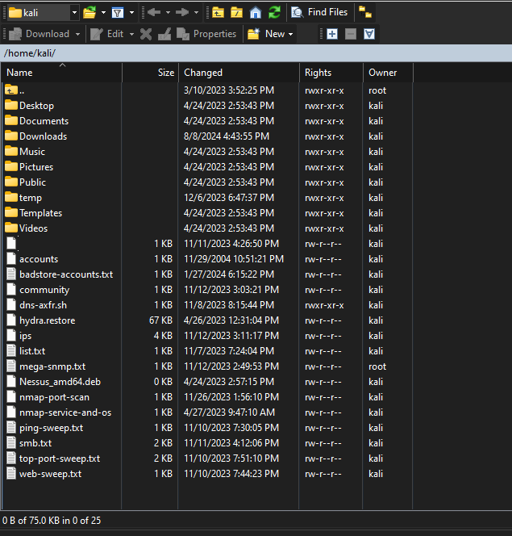
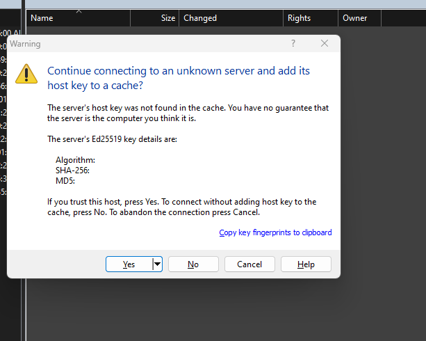
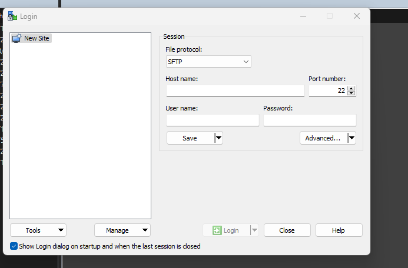

# SSH connection to winscp



jos haluaa suorittaa siirron yhteyden esim. kali linx suoritettua muistiinpanoja, ladattua tiedostoa ja jne. jotain tärkeitä tiedostoja jotka pyörii siellä sisällä, mutta ei saa sitä ulos.

suorita tämmöinen päivitys & vähä kuin pieni restart

```
┌──(kali㉿kali)-[~] 
└─$ service ssh restart
```


## WInscp
perus otettaan ssh yhteydellä (yleinen etäyhteys SSH-palvelimen yhteys toisesta koneen kautta konsoliin). Perus salaa kaikki laitteiden yhteyden välillä lähetetyt tiedostot ja estääkseen tietojen varastamista ja suojaa yhteyden. SSH käytetään yleisesti pavelimien hallintaan ja etätehtävien suorittamista.

Yhteyden muodostamisessa pitää tarkistaa oman kali linux IP-osoite `$ip a|add`
Hostname kenttään tulee just se kali linux ip-osoite, username ja password oletuksena (millä kirjauduttaan kali linux) joko se on root|root , admin|admin ja jne.





