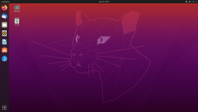
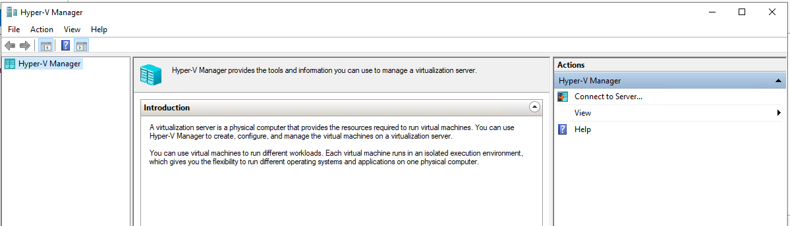

# Linux työkalu 

- [Grafana](#Grafana)
- [Prometheus](#Prometheus)
- [Bash shell](#Bash-shell)
- [Wireshark](#Wireshark)

# Virtuaalikoneet 

- [VmWare](#VmWare)
- [Virtualbox](#Virtualbox)
- [Hyper v](#hyper-v)

# VmWare
Tämä on workstaion pro versio ja n. ladattuna 1.GB päälle

# Virtualbox 
ladattuna n. 200-300 MB

# Hyper v

# Grafana

# Prometheus

# Bash shell

# Wireshark

