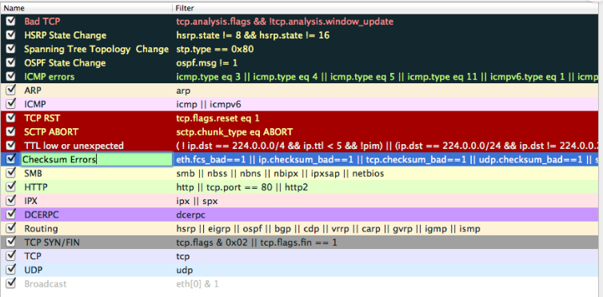

# Wireshark

Wireshark käyttö

# Värikoodit

Käyttäjä voi nähdä kaapatut paketit korostettuna värillä. Wireshark käyttää näitä värejä auttamaan käyttäjää tunnistamaan yhdellä silmäyksellä kaapatun liikenteen tyypin. Sovelluksessa voi nähdä tarkalleen, mitä värikoodit tarkoittavat ja vähä tarkentaa värikoodien ja teknisen kuvauksen, sekä voi myös tarvittaess muokata värisääntöjä jos haluaa.

| väri | kuvaus | 
| ----- | ----- |
| $\textcolor{ #e7e6ff}{Vaaleanvioletti}$ | TCP - liikenne |
| $\textcolor{ #e7e6ff}{harmaa}$ | TCP-paketti SYN- tai FIN-lipulla |
| $\textcolor{ #a40000}{punainen}$ | TCP-paketti RST-lipulla |
| $\textcolor{ #12272e}{musta}$ | TCP-paketit, joissa on ongelma (yleensä paketteja, joissa on sekava järjestysnumero) |
| $\textcolor{ #e4ffc7}{vaaleanvihreä}$ | HTTP liikenne |
| $\textcolor{ #daeeff}{vaaleansininen }$ | DNS ja UDP liikenne |

# ubuntu

$sudo wireshark 
käynnistää varsinaisen wireshark sovelluksen käyntii, ja jos laitaa kommentoon vaan $wireshark , niin aktivoituu sovellus, mutta sisäisen varsinaisen verkkojen seurata datat ei

$apt show wireshark  
tulostaa wireshark sovelluksen version esim. 3.2.1.0
 

# ohje kuinka ladataan wireshark ubuntun kautta & ja kuinka aktivoidaan se sovellus
https://linuxhint.com/install_configure_wireshark_ubuntu/

https://www.youtube.com/watch?v=rtm_Bofv4-8
