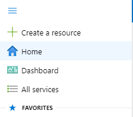
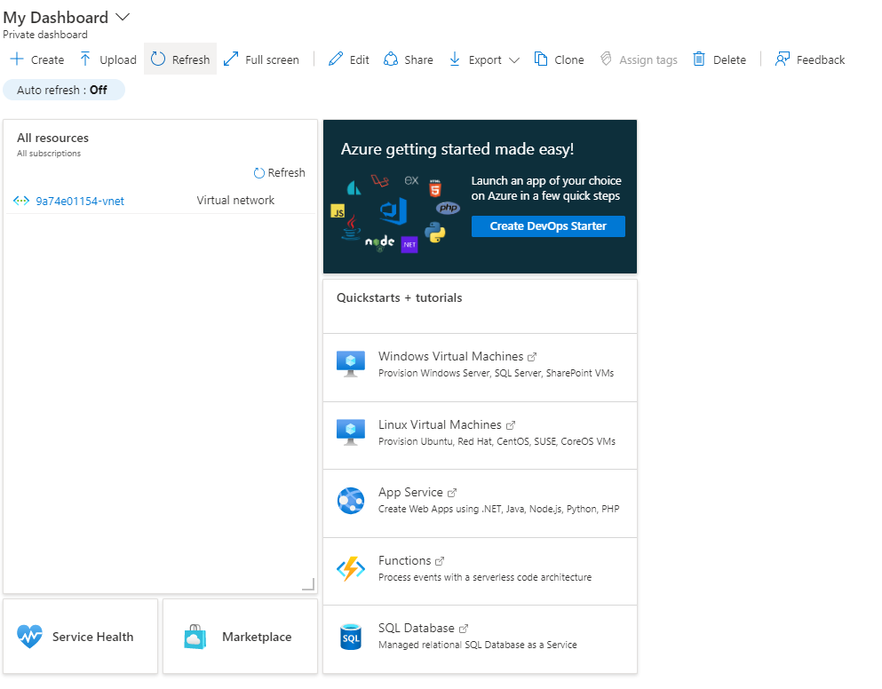
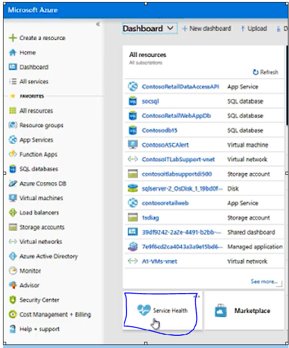
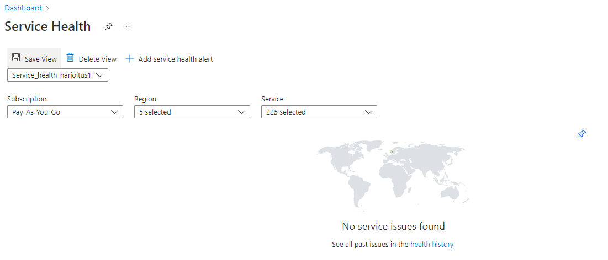
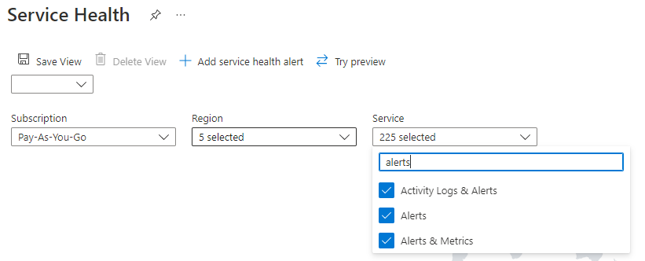
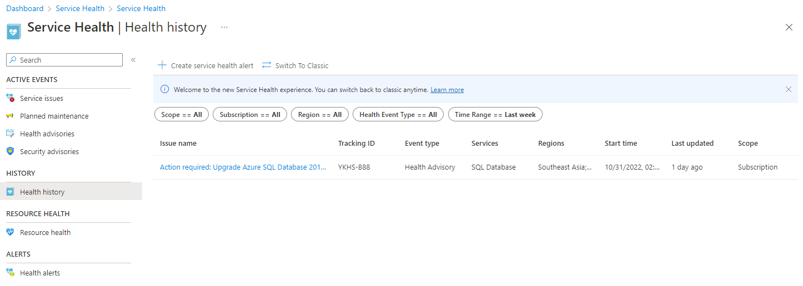
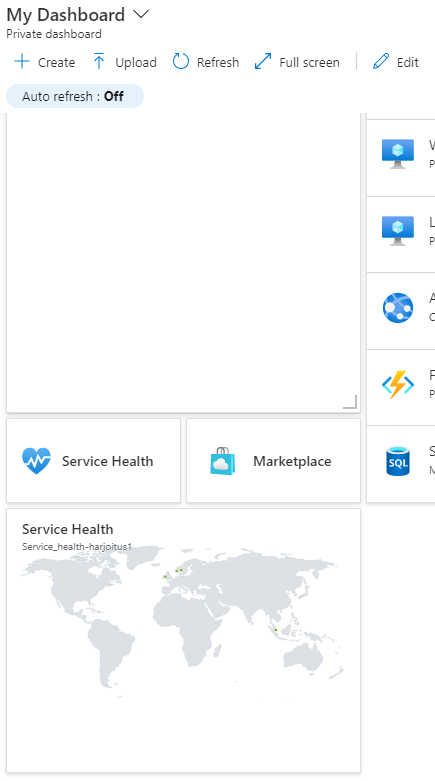
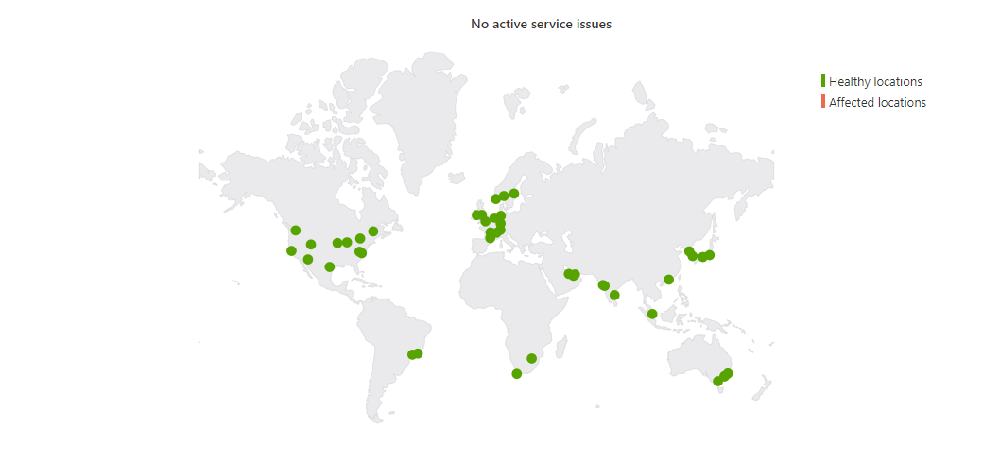
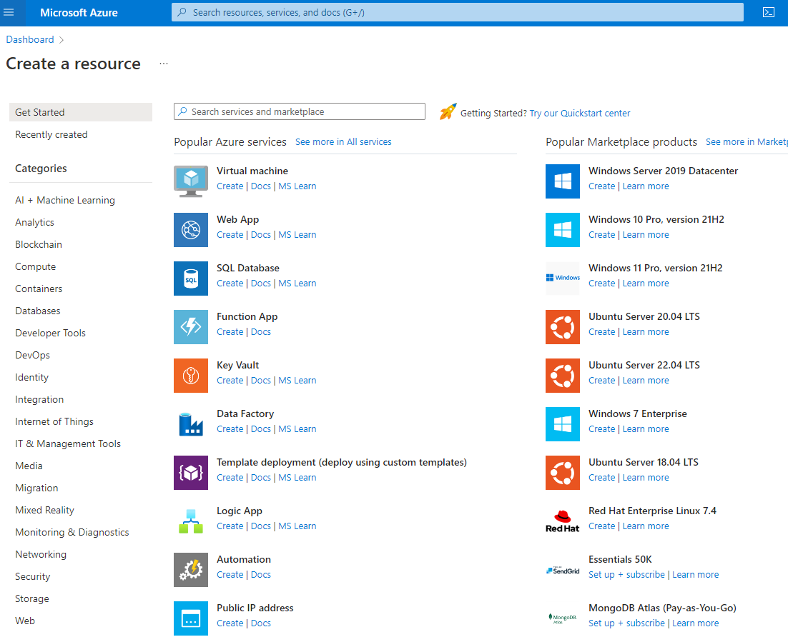

# Harjoitus 1

- [Osa 1](#Osa-1)
- [Osa 2](#Osa-2)
- [Osa 3](#Osa-3)

## Osa 1
Jos sinulta kysytään Default-näkymää sivun avautuessa, valitse Dashboard ja klikkaa Save. Valitse Dashboard ja tutki näkymän eri vaihtohetoja. Dashboard löytyy vasemman yläkulman kolmewn viivan alta.

<!--  -->

Dashboard ikkuna

Valitse Service Health ja tutki avautuvasta näkymästä yleistietoja. Katso aicun linkistä ongelmatilanteiden historiatiedot <b> (Health History) </b> ja saman ikkunan valikosta suunnitellut ylläpitotapahtumat <b>(Planned Maintenance) </b>. Tutki myös, miten voit luoda hälytyksiä (Health Alerts). Palaa Dashboardiin klikkaamalla vasemman yläkulman linkistä Dashboard

Clikkaa tuosta kartta alemmasta josta on linkki, että avautuu (Service Health | Health history) & ihan oikealla on tommoinen pinni, josta voi laittaa Dashboard ikkunaan näytölle  

## Osa 2

Mene Home -sivulle klikkaamalla vasemman yläkulman ”Microsoft Azure” -tekstiä. Tutki, miten resursseja luodaan Azureen. Klikkaa valikosta + <b> Create a Resource </b> -valintaa. Huomaa, että valinta avaa Azure Marketplacen, josta voit valita valmiiksi määriteltyjä resursseja. Älä valitse vielä tässä vaiheessa mitään.

## Osa 3

Hae tilauksesi tiedot kirjoittamalla <b> Subscriptions </b> yläpalkin hakukenttään. Näet yhden tilauksen nimeltään <b> Pay-as-you-Go </b> . Klikkaa sitä avataksesi tilauksen asetusbladen. Valitse valikosta Cost Analysis ja tutki, mitkä resurssit ovat aiheuttaneet suurimman laskutuksen. Paljonko laskua on kertynyt? Mikä on ennuste nykyisellä kustannusrakenteella?

Avaa valikosta Access Control (IAM) -blade. Valitse Role Assignments ja tarkista, kenelle on myönnetty Owner -rooli tilaukseen. Katso. Mitä muuta tietoa tilauksestasi saat valikon valintojen avulla.

## Osa 4

Palaa takaisin Subscriptions -bladeen klikkaamalla Subscriptions -osaa vasemman yläkulman Home > Subscriptions -linkistä. Liitä Subscription -blade omaan Dahsboardiisi Pay-as-you-Go -tilauksen perässä olevasta kolmen pisteen valikosta klikkaamalla Pin to Sashboard. Tarkista, että Subscription -pikakuvake näkyy Dashboardissa. 
