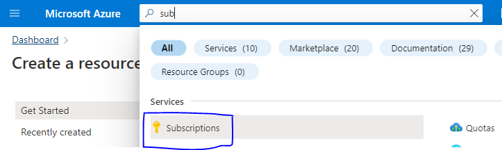
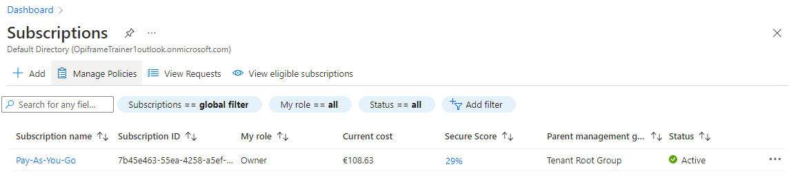
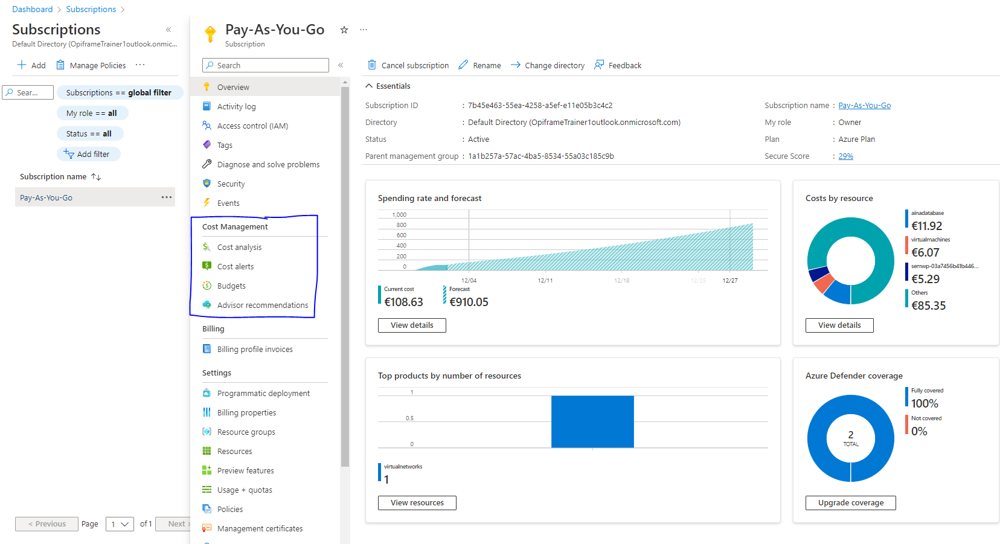
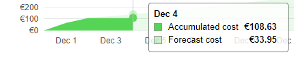
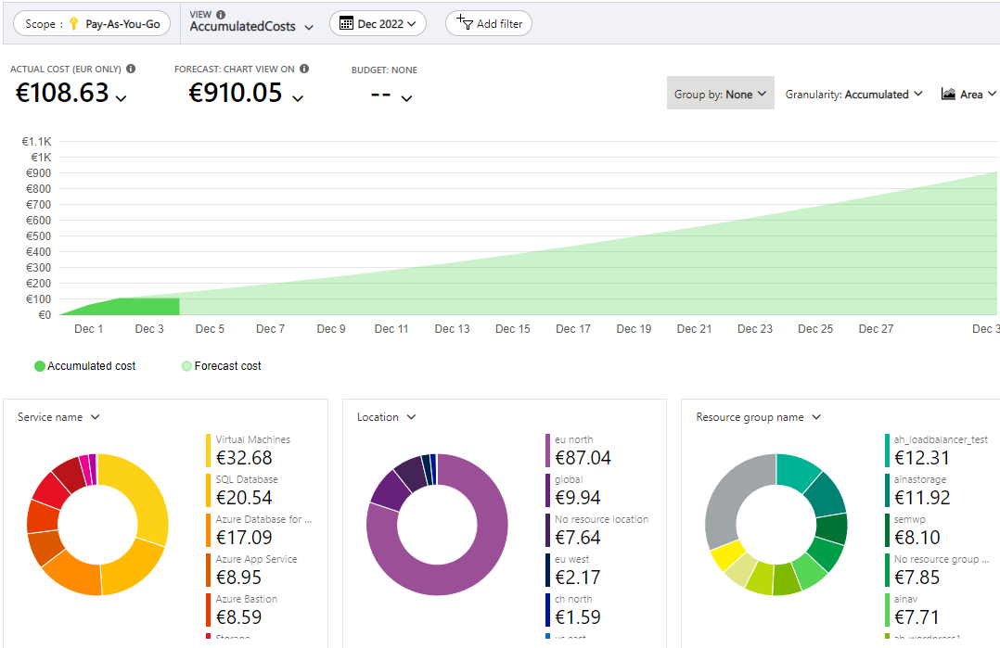
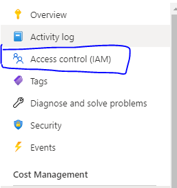
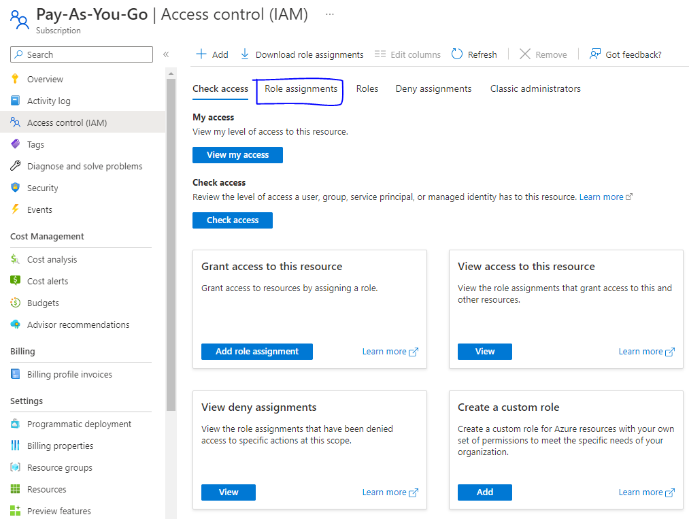
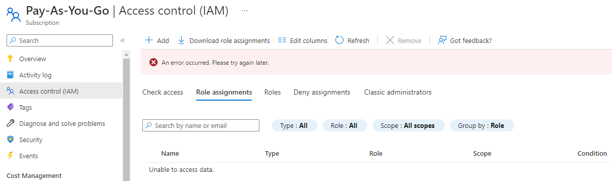

# ensimmäinen harjoitus
Eneimmäisenä piti saada ensin tunnukset, että vasta pääsee microsoft azure sisään eli linkki on: portal.azure.com

- [Osa 1 dashboard](#Osa-1-dashboard)
- [Osa 2 resurssit](#Osa-2-resurssit)
- [Osa 3 haku](#Osa-3-haku)
- [Osa 4](#Osa-4)

## Osa 1 dashboard
Jos sinulta kysytään Default-näkymää sivun avautuessa, valitse Dashboard ja klikkaa Save. Valitse Dashboard ja tutki näkymän eri vaihtohetoja. Dashboard löytyy vasemman yläkulman kolmewn viivan alta.

<!--  -->

Dashboard ikkuna

Valitse Service Health ja tutki avautuvasta näkymästä yleistietoja. Katso aicun linkistä ongelmatilanteiden historiatiedot <b> (Health History) </b> ja saman ikkunan valikosta suunnitellut ylläpitotapahtumat <b>(Planned Maintenance) </b>. Tutki myös, miten voit luoda hälytyksiä (Health Alerts). Palaa Dashboardiin klikkaamalla vasemman yläkulman linkistä Dashboard

Clikkaa tuosta kartta alemmasta josta on linkki, että avautuu (Service Health | Health history) & ihan oikealla on tommoinen pinni, josta voi laittaa Dashboard ikkunaan näytölle  

## Osa 2 resurssit

Mene Home -sivulle klikkaamalla vasemman yläkulman ”Microsoft Azure” -tekstiä. Tutki, miten resursseja luodaan Azureen. Klikkaa valikosta + <b> Create a Resource </b> -valintaa. Huomaa, että valinta avaa Azure Marketplacen, josta voit valita valmiiksi määriteltyjä resursseja. Älä valitse vielä tässä vaiheessa mitään.

## Osa 3 haku

Hae tilauksesi tiedot kirjoittamalla <b> Subscriptions </b> yläpalkin hakukenttään. Näet yhden tilauksen nimeltään <b> Pay-as-you-Go </b> . Klikkaa sitä avataksesi tilauksen asetusbladen. Valitse valikosta Cost Analysis ja tutki, mitkä resurssit ovat aiheuttaneet suurimman laskutuksen. Paljonko laskua on kertynyt? Mikä on ennuste nykyisellä kustannusrakenteella?

Tummempi/shokki/kirkaampi värinen vihreä on kertynyt kustannus (acumulated cost) ja vaalea vihreä ennuste kustannus (forecast cost) & 1.joulukuusta alkaen n. 108.62e, eli mahdollista joulukuun loppulla ennustaa n. 910.05e  

Avaa valikosta Access Control (IAM) -blade. Valitse Role Assignments ja tarkista, kenelle on myönnetty Owner -rooli tilaukseen. Katso. Mitä muuta tietoa tilauksestasi saat valikon valintojen avulla.

## Osa 4

Palaa takaisin Subscriptions -bladeen klikkaamalla Subscriptions -osaa vasemman yläkulman Home > Subscriptions -linkistä. Liitä Subscription -blade omaan Dahsboardiisi Pay-as-you-Go -tilauksen perässä olevasta kolmen pisteen valikosta klikkaamalla Pin to Sashboard. Tarkista, että Subscription -pikakuvake näkyy Dashboardissa. 
