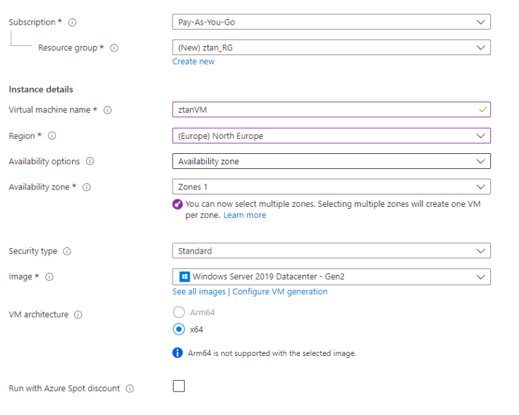
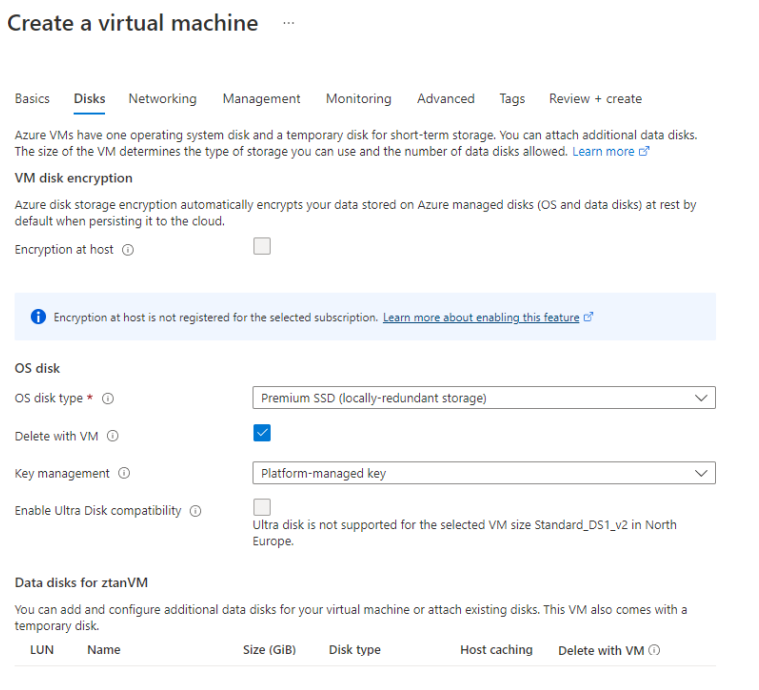
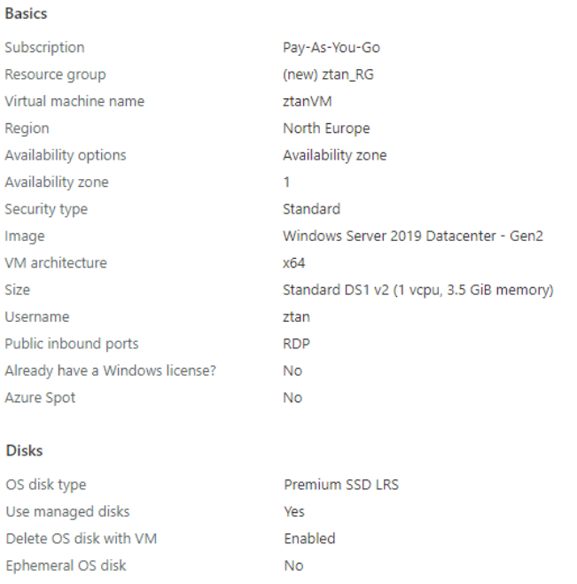
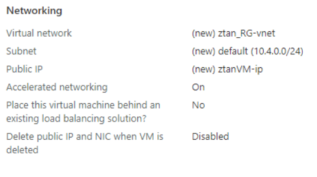
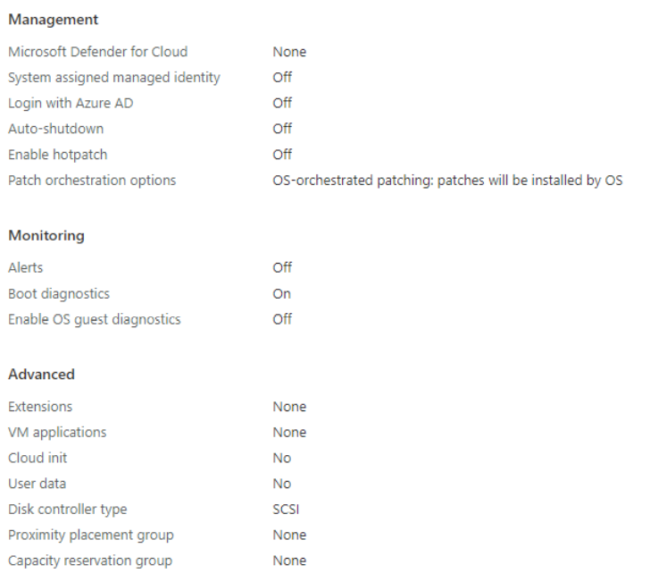
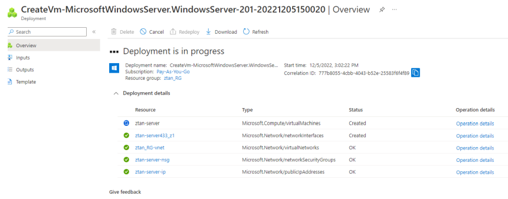
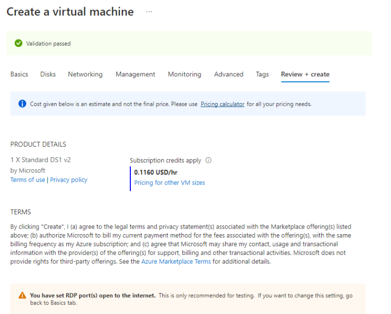

# harjoitus 3
Resurssien luonti, että luodaan pieni virtuaalikone (VDI)

<!--  -->

1. Avaa koneesi selaimesta portal.azure.com ja kirjaudu sisään. Klikkaa vasemmasta laidasta + Create a Resource -valintaa ja valitse Windows Server 2019 Datacenter. Anna seuraavat tiedot:  

Resource Group: Valitse create new ja anna sille joku yksilöllinen nimi  
Virtual Machine Name: Anna joku yksilöllinen nimi koneelle  
Region: (Europe) North Europe  

Size: Valitse Change size ja valitse listasta Standard B2ms  

Username: Joku tunnus pääkäyttäjäksi  
Password: Anna joku validi salasana, min. 12 merkkiä (älä unohda antamaasi salasanaa )  
Vahvista salasanasi  

Klikkaa Next:Disks>  
Tarkista, että valinta on Premium SSD (locally-redundant storage). Ei luoda vielä datalevyjä.  
Klikkaa Next: Networking >  

Klikkaa Review + Create. Tarkista, että validointi meni läpi ja klikkaa Create. Odota, kunnes virtuaalikone on luotu.  

Tarkista, että virtuaalikoneresurssiin ei ole liitetty ongelmailmoituksia. Avaa virtuaalikoneen blade (overview) klikkaamalla sitä ja mene valikossa alaspäin kohtaan Help. Valitse Resource Health ja tarkista, ettei hälyttäviä ilmoituksia ole.  

