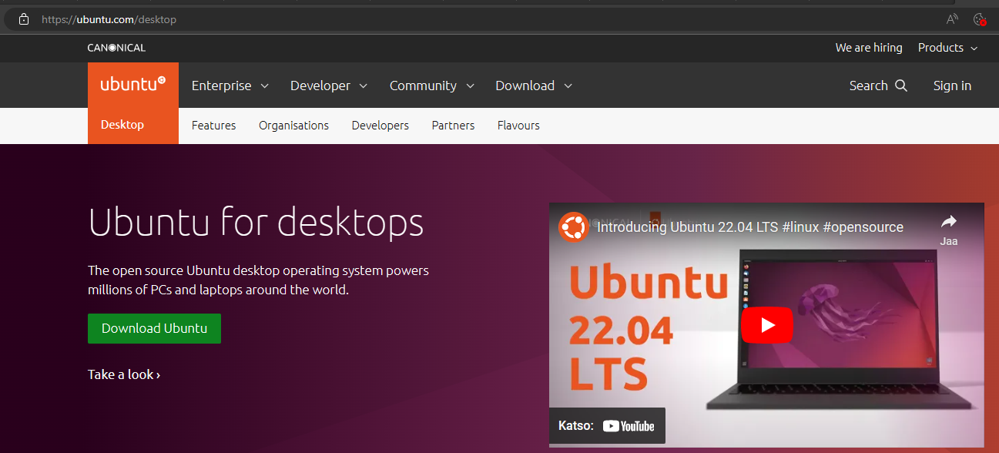

# vmware windows 10 simulaatio

valmis pieni vmware simulaatio windows 10 ympäristö ja ladattuna ubuntu 

## VMware Workstation Pro & license key

VMwarella on kaksi tyyppistä versiota, että yksi on kokonainen pro ja toinen kokeilu versio oisko n. 1kk kokeilu tai tiety määräaikainen. Pro versiosta saa kuin itselle ikuisuuden version tai just tämmöinen simulaatio työkalu versio hyöydyntää ikuisuuden seuraavan pari-muutaman vuoden, ettei katoa mihinkään ellei päivitä seuraava versiota.

https://www.vmware.com/fi/products/workstation-pro/workstation-pro-evaluation.html

Pro versiolla siihen tarvitaan lisenssi avain, ja avainta saa usein github:sta, että riippuu kuka julkaisee ensimmäisenä/toisena ja jne, että se avain toimii. esim. vuoden 2023 vmware avain löytyy tältä  
https://gist.github.com/PurpleVibe32/30a802c3c8ec902e1487024cdea26251

## Windows 10

Virtuaali koneseen tarvitaan .iso file tiedosto tyyppiä, jotta suorittaa sen prosessin ja ilman .iso tiedosto tyyppiä niin se ei toimisi &
linkistä saa windows 10 iso tiedosot tyyppin ja se on n. melkee 5GB

 
https://www.microsoft.com/en-us/software-download/windows10

## ubuntu file

Sama koskien jos käyttää ubuntua eli linux:sta niin sama koskee tarvitaan .iso tiedosto tyyppiä, jotta suoritettaan virtuaalikone & sama koskien ubuntu riippumatta versiosta, että onko uusin vai vanha niin se ois melkee n. 3GB iso tiedosto

 
https://ubuntu.com/desktop

## Fortigate firewall

Fortigate palomuuri on oma sivusto josta saada ladattua iso file tiedoston, jonka periaatteessa joutuu hakee forti cloud

## Perus ohjeistukset:

https://www.youtube.com/watch?v=8V46I8YQNwg

https://www.youtube.com/watch?v=mAcmC23J4sA

https://www.youtube.com/watch?v=B1tCRwkFmnA

https://www.youtube.com/watch?v=9rUhGWijf9U
